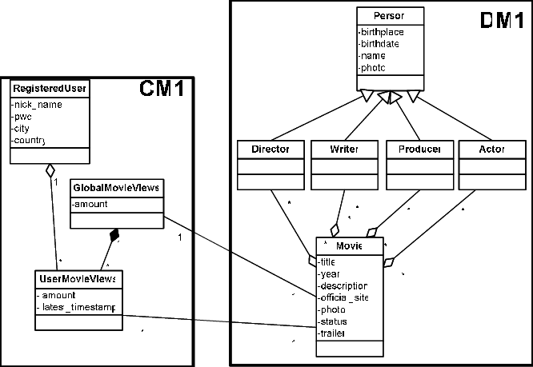

# NoSQL Platform on Docker

## Provisioning environment
The environment for this course is completly based on docker containers. 

In order to simplify the provisioning, a single docker-compose configuration is used. All the necessary software will be provisioned using Docker. 

You have the follwing options to start the environment:

 * [**Local Virtual Machine Environment**](./LocalVirtualMachine.md) - a Virtual Machine with Docker and Docker Compose pre-installed will be distributed at by the course instructure. You will need 50 GB free disk space.
 * [**Local Docker Enironment**](./LocalDocker.md) - you have a local Docker and Docker Compose setup in place which you want to use
 * [**AWS Lightsail Environment**](./Lightsail.md) - AWS Lightsail is a service in Amazon Web Services (AWS) with which we can easily startup a environment and provide all the necessary bootstraping as a script.


## Post Provisioning

These steps are necessary after the starting the docker environment. 

### Add entry to local /etc/hosts File
To simplify working with the Streaming Platform and for the links below to work, add the following entry to your local `/etc/hosts` file. 

```
40.91.195.92	nosqlplatform
```

Replace the IP address by the PUBLIC IP of the docker host. 

## Services accessible on Streaming Platform
The following service are available as part of the platform:

Product | Type | Service | Url
------|------| --------| ----
Redis | Development | Redis Commander | <http://nosqlplatform:38083>
Cassandra | Development | Cassandra-Web | <http://nosqlplatform:33000>
MongoDB | Management | Admin Mongo | <http://nosqlplatform:31234>
MongoDB | Development | Mongo-Express | <http://nosqlplatform:38082>
Elasticsearch | Development | Dejavu | <http://nosqlplatform:1358>
Elasticsearch | Development | cerebro | <http://nosqlplatform:39000>
Elasticsearch | Development | Kibana | <http://nosqlplatform:5601>
Elasticsearch | Development | ElasticHQ | <http://nosqlplatform:35000>
Solr | Management | Solr | <http://nosqlplatform:8983>
Neo4J | Development | Neo4J | <http://nosqlplatform:7474>
Grafana | Development | Grafana | <http://nosqlplatform:3010>
Zepplin | Development | Zeppelin | <http://nosqlplatform:38081>
Jupyter | Development | Jupyter | <http://nosqlplatform:10000>


## Workshop based on IMDd

For the workshop we are going to use data from [IMDb](https://www.imdb.com/). 

The following diagram shows the conceptual model of IMDb. 



The data has been downloaded using the following Jupyter notebook (link to be added). 
