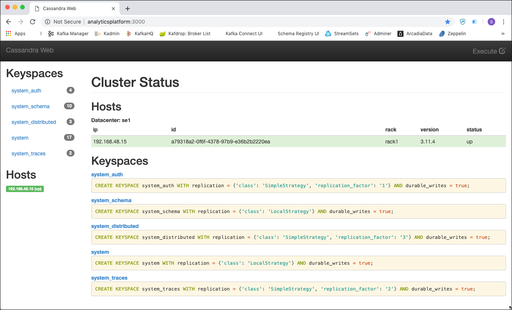
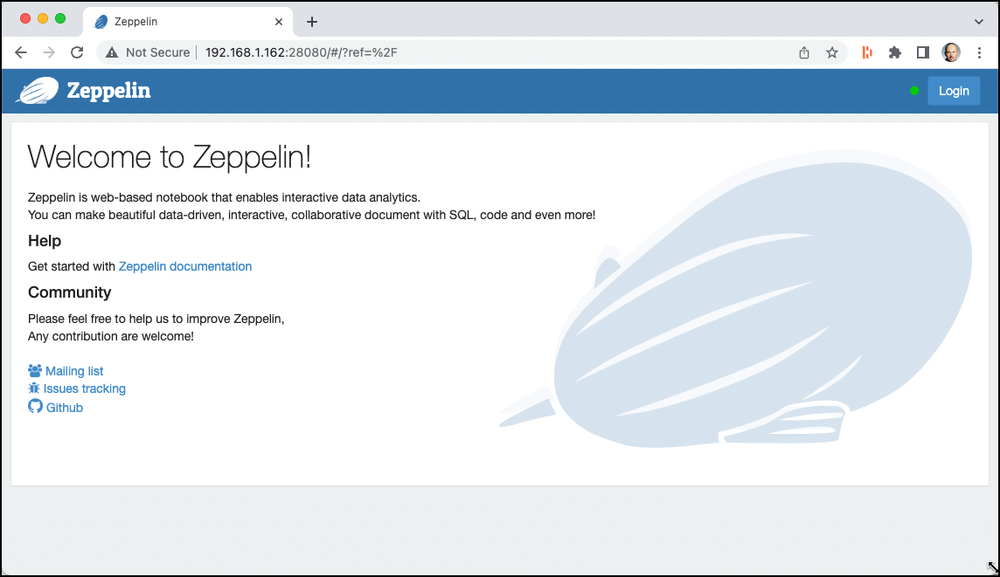
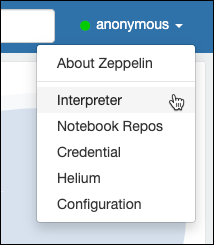
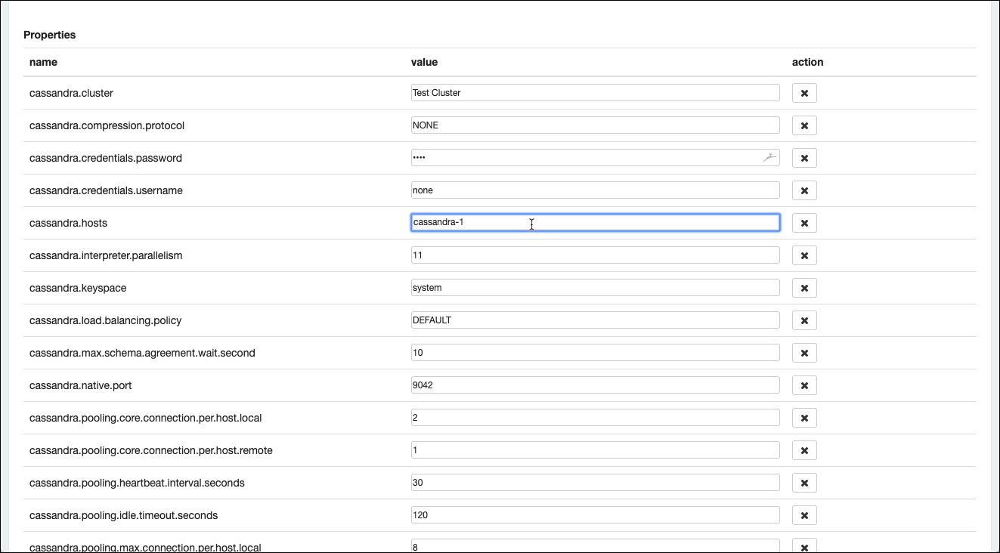
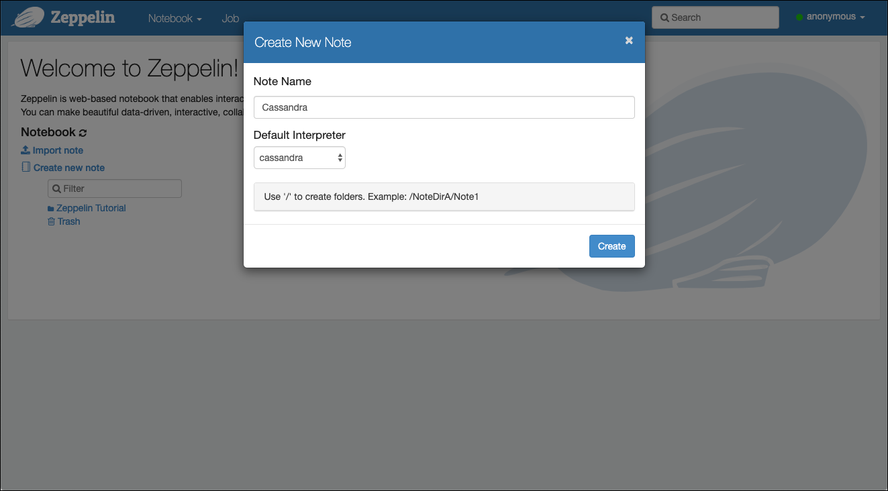

# Working with Cassandra
In this workshop we will learn how to use the Apache Cassandra NoSQL database.

We assume that the platform described [here](../01-environment) is running and accessible. 

## Connecting to the Cassandra environment

### Using the Cassandra Command Line utility

You can find the `cqlsh` command line utility inside the Cassandra docker container running as part of the platform. Connect via SSH onto the Docker Host and run the following `docker exec` command 

```
docker exec -ti cassandra-1 cqlsh
```

This will connect you into the `cassandra-1` container and run the `cqlsh` inside id. You should see an output similar to this one. 

```
bigdata@bigdata:~$ docker exec -ti cassandra-1 cqlsh
Connected to Test Cluster at 127.0.0.1:9042.
[cqlsh 5.0.1 | Cassandra 3.11.5 | CQL spec 3.4.4 | Native protocol v4]
Use HELP for help.
cqlsh>
```

You are now at the Cassandra CQL command prompt, ready to execute CQL statements. 

We can also see the actual version of Cassandra, CQL and cqlsh available to us. 

### Using browser-based GUI
Instead of working over the command line and therefore having to connect to the Docker Host via SSH, we can also use a browser based GUI to access Cassandra. Two browser-based utilities are available as part of the platform. 

#### Cassandra Web

The first one is the [Cassandra Web](http://avalanche123.com/cassandra-web/).
In a browser window navigate to <http://dataplatform:28120/> and you should directly get to the home screen as shown below. 



If you click on **Execute** in the top-right corner, a pop-window will appear where you can enter CQL statements and execute them. 

#### Apache Zeppelin

Another universal "data" tool is [Apache Zeppelin](http://zeppelin.apache.org). In a browser window, navigate to <http://dataplatform:28080/> and you should directly arrive on the home screen as shown below. 



Apache Zeppelin uses a so called "Notebook" based model that enables data-driven, interactive data analytics and collaborative documents with SQL, Scala and more.

Zeppelin uses the concept of interpreters. Each Interpreter has the capability to "talk" to a given data systems. When creating a Notebook, you can specify the "default" interpreter to use, all other interpreters can be used as well, but then the directive `%<interpreter-name>`has to be used in each cell. 

Zeppelin has a Cassandra interpreter, which we will use here. But before we can use it, it has to be configured. Click on **anonymous** drop-down and select **Interpreter** as shown in the image below. 



Navigate to the **Cassandra** Interpreter either by searching for it or scrolling down to reach it. Click on **edit** and change the **cassandra.host** property to `cassandra-1`, which is the service name of our Cassandra node in the docker-compose configuration. 



Scroll-down to the end of the Interpreter settings and click **Save**. Confirm that you want Zeppelin to restart the Interpreter with the new settings. 

Click on **Zeppelin** in the upper left corner to navigate back to the Home screen. 

Now let's create a new notebook by clicking on the **Create new note** link. On the pop-up window enter `Cassandra` into the **Note Name** field and select **cassandra** for the **Default Interpreter** and click **Create**. 



An empty notebook with one cell will appear. This cell is now ready to be used and has the Cassandra interpreted assigned. Enter each command into a separate cell and either click on the **play** icon on the right or hit **Ctrl-Enter** to execute the cell. A new cell will automatically appear when executing the current one. 

For all the commands which follow now in this workshop, you can either use one of the 3 different options shown above. Of course you an also mix to your liking. 

## Create a Keyspace for the Movie sample

Keyspace in Cassandra is the equivalent of database/schema in relational databases. While creating a keyspace, you need to specify replication settings:

```
CREATE KEYSPACE movies WITH replication =
  {'class':'SimpleStrategy','replication_factor':1};
```

We'll be using SimpleStrategy to keep things simple, because our Cassandra setup is just single node. 

In a production environment, where it's usually common to have multiple datacenters, `NetworkTopologyStrategy` is generally used because it better distributes data across datacenters.

Replication factor = 1 means there will be single copy of a row on a particular node. Higher replication factors are set up in real systems for creating multiple replicas that ensures data availability in case of disk failures.

To be able to work with tables, you need to use your keyspace, as shown in the following statement:

```
USE movies;
```

Another option is to prefix the table name with the keyspace name in all queries, similar to what you can do when referencing the schema in an RDBMS.

At any time, you can `DESCRIBE` the keyspace, use the following command to do that: 

```
DESCRIBE KEYSPACE movies;
```

and you should see an output similar to the one shown below

```
CREATE KEYSPACE movies WITH replication = {'class': 'SimpleStrategy', 'replication_factor': '1'}  AND durable_writes = true;
```

If you wish to list all keyspaces present in the database, a Cassandra reserve keyspace named system comes in handy. It contains many system-defined tables for database objects definition and cluster configuration. Let's list all records from the `schema_keyspaces` table that contains records for each keyspace. 

Enter the following command:

```
SELECT * FROM system_schema.keyspaces;
```

The output of this command looks as follows:

```
 keyspace_name      | durable_writes | replication
--------------------+----------------+-------------------------------------------------------------------------------------
        system_auth |           True | {'class': 'org.apache.cassandra.locator.SimpleStrategy', 'replication_factor': '1'}
      system_schema |           True |                             {'class': 'org.apache.cassandra.locator.LocalStrategy'}
             movies |           True | {'class': 'org.apache.cassandra.locator.SimpleStrategy', 'replication_factor': '1'}
 system_distributed |           True | {'class': 'org.apache.cassandra.locator.SimpleStrategy', 'replication_factor': '3'}
             system |           True |                             {'class': 'org.apache.cassandra.locator.LocalStrategy'}
      system_traces |           True | {'class': 'org.apache.cassandra.locator.SimpleStrategy', 'replication_factor': '2'}
```

## Using "Static" Tables (skinny row)

### Create the Movie and Actor table

Run the following statement for creating a table called user. For those who are acquainted with SQL, the following syntax should look very familiar and almost identical. Even some of the naming conventions as well as formatting guidelines can be reused.

```
DROP TABLE IF EXISTS movies.movie;
CREATE TABLE movies.movie (movie_id int,
	title text,				// title
	release_year int,		// year
	running_time int, 		// runtimes	
	languages set<text>, 	// language codes
	genres set<text>,      	// genres
	plot_outline text,    	// plot outline
   cover_url text, 			// cover url
   top250_rank int,			// top 250 rank
   PRIMARY KEY (movie_id)
);
```

This creates a first static column family (table) in Cassandra. Now do the same for the Actor table. 

```
DROP TABLE IF EXISTS movies.actor;
CREATE TABLE movies.actor (actor_id int, 
  name text,					// name
  headshot_url text,		// headshot
  mini_biography text,		// mini biography
  birth_date text,			// birth date
  trade_mark list<text>,	// trade mark
  PRIMARY KEY (actor_id)
);
```

You can view a table metadata using the `DESCRIBE` command, as shown in the following statement

```
DESCRIBE TABLE movie;
DESCRIBE TABLE actor;
```

### Inserting Data into Movie and Actor

In Cassandra, an INSERT operation is actually an "Upsert" (UPDATE or INSERT), which means columns are updated in case a row for the given primary key already exists, otherwise all columns are freshly inserted.

First lets add the movie "The Matrix" and "Pulp Fiction"

```
// insert "The Matrix" - 0133093
INSERT INTO movies.movie (movie_id, title, release_year, running_time, languages, 
                   genres, plot_outline, cover_url, top250_rank)
VALUES (0133093,
        'The Matrix',
 		1999,
 		136,
      {'en'},
      {'Action', 'Sci-Fi'},
      $$Thomas A. Anderson is a man living two lives. By day he is an average computer programmer and by night a hacker known as Neo. Neo has always questioned his reality, but the truth is far beyond his imagination. Neo finds himself targeted by the police when he is contacted by Morpheus, a legendary computer hacker branded a terrorist by the government. Morpheus awakens Neo to the real world, a ravaged wasteland where most of humanity have been captured by a race of machines that live off of the humans' body heat and electrochemical energy and who imprison their minds within an artificial reality known as the Matrix. As a rebel against the machines, Neo must return to the Matrix and confront the agents: super-powerful computer programs devoted to snuffing out Neo and the entire human rebellion$$,
      'https://m.media-amazon.com/images/M/MV5BNzQzOTk3OTAtNDQ0Zi00ZTVkLWI0MTEtMDllZjNkYzNjNTc4L2ltYWdlXkEyXkFqcGdeQXVyNjU0OTQ0OTY@._V1_SX101_CR0,0,101,150_.jpg',
      19);

// insert "Pulp Fiction" - 0110912
INSERT INTO movies.movie (movie_id, title, release_year, running_time, languages, 
                   genres, plot_outline, cover_url, top250_rank)
VALUES (0110912,
 		'Pulp Fiction',
 		1994,
 		154,
 		{'en', 'es', 'fr'},
 		{'Crime', 'Drama'},
 		$$Jules Winnfield (Samuel L. Jackson) and Vincent Vega (John Travolta) are two hit men who are out to retrieve a suitcase stolen from their employer, mob boss Marsellus Wallace (Ving Rhames). Wallace has also asked Vincent to take his wife Mia (Uma Thurman) out a few days later when Wallace himself will be out of town. Butch Coolidge (Bruce Willis) is an aging boxer who is paid by Wallace to lose his fight. The lives of these seemingly unrelated people are woven together comprising of a series of funny, bizarre and uncalled-for incidents.$$,
 		'https://m.media-amazon.com/images/M/MV5BNGNhMDIzZTUtNTBlZi00MTRlLWFjM2ItYzViMjE3YzI5MjljXkEyXkFqcGdeQXVyNzkwMjQ5NzM@._V1_SY150_CR1,0,101,150_.jpg',
 		8);
 		
// insert "Speed" - 0111257
INSERT INTO movies.movie (movie_id, title, release_year, running_time, languages, 
                   genres, plot_outline, cover_url, top250_rank)
VALUES (0111257,
		 'Speed',
		 1994,
		 116,
		 {'en'},
		 {'Action', 'Adventure', 'Crime', 'Thriller'},
		 $$Bomber extortionist's elevator plan backfires, so he rigs a bomb to a LA city bus. The stipulation is: once armed, the bus must stay above 50 mph to keep from exploding. Also if LAPD Officer tries to unload any passengers off, Payne will detonate it. Joe Morton co-stars as Jack's superior, and Jeff Daniels supports Jack helping him try to defuse the bomb.$$,
		 'https://m.media-amazon.com/images/M/MV5BYjc0MjYyN2EtZGRhMy00NzJiLWI2Y2QtYzhiYTU3NzAxNzg4XkEyXkFqcGdeQXVyMTQxNzMzNDI@._V1_SY150_CR0,0,101,150_.jpg'
		  null); 		
```

Now let's also add some actors playing in these 2 movies. 

Let's add the actor "Bruce Willis", "John Travolta", "Sandra Bullock", "Samuel L. Jackson", "Uma Thurman" & "Quentin Tarantino"

```
// insert "Bruce Willis" - 0000246
INSERT INTO movies.actor (actor_id, name, headshot_url, birth_date, trade_mark)
VALUES (0000246,
 		'Bruce Willis',
 		'https://m.media-amazon.com/images/M/MV5BMjA0MjMzMTE5OF5BMl5BanBnXkFtZTcwMzQ2ODE3Mw@@._V1_UY98_CR8,0,67,98_AL_.jpg',
 		'1955-03-19',
		 ['Frequently plays a man who suffered a tragedy, had lost something or had a  crisis of confidence or conscience.',
		  'Frequently plays likeable wisecracking heroes with a moral centre',
		  'Headlines action-adventures, often playing a policeman, hitman or someone in the military',
		  'Often plays men who get caught up in situations far beyond their control',
		  'Sardonic one-liners',
		  'Shaven head',
		  'Distinctive, gravelly voice',
		  'Smirky grin.',
		  'Known for playing cynical anti-heroes with unhappy personal lives']);

// insert "John Travolta" - 0000237
INSERT INTO movies.actor (actor_id, name, headshot_url, birth_date, trade_mark)
VALUES (0000237,
		 'John Travolta',
		 'https://m.media-amazon.com/images/M/MV5BMTUwNjQ0ODkxN15BMl5BanBnXkFtZTcwMDc5NjQwNw@@._V1_UY98_CR3,0,67,98_AL_.jpg',
		 '1954-02-18',
		 ['Cleft chin and razor-sharp cheekbones',
		  'Often works some sort of dance into his roles',
		  'New Jersey accent',
		  'Black hair and blue eyes']);


// insert "Sandra Bullock" - 0000113
INSERT INTO movies.actor (actor_id, name, headshot_url, birth_date, trade_mark)
VALUES (0000113,
		'Sandra Bullock',
        'https://m.media-amazon.com/images/M/MV5BMTI5NDY5NjU3NF5BMl5BanBnXkFtZTcwMzQ0MTMyMw@@._V1_UX67_CR0,0,67,98_AL_.jpg',
        '1964-07-26',
        null);
        
// insert "Samuel L. Jackson" - 0000168
INSERT INTO movies.actor (actor_id, name, headshot_url, birth_date, trade_mark)
VALUES (0000168,
		 'Samuel L. Jackson',
		 'https://m.media-amazon.com/images/M/MV5BMTQ1NTQwMTYxNl5BMl5BanBnXkFtZTYwMjA1MzY1._V1_UX67_CR0,0,67,98_AL_.jpg',
		 '1948-12-21',
		 ['Deep authoritative voice',
		  'Rebellious characters who are disliked or considered strange by others in the story',
		  'Often plays police officers or government officials. Both prone to intimidation or violence',
		  'Often plays very wise and intelligent characters with great capacities for violence',
		  'Frequently plays tough characters who swear a lot',
		  'Frequent swearing',
		  'Often sports a moustache or goatee in his films',
		  'Shaven head',
		  'Kangol hats',
		  'Often plays hotheaded characters with a fiery temper',
		  'Often shouts the word "motherf*****" at some point in a film',
		  'Frequently cast by Quentin Tarantino']);

// insert "Uma Thurman" - 0000235
INSERT INTO movies.actor (actor_id, name, headshot_url, birth_date, trade_mark)
VALUES (0000235,
		 'Uma Thurman',
		 'https://m.media-amazon.com/images/M/MV5BMjMxNzk1MTQyMl5BMl5BanBnXkFtZTgwMDIzMDEyMTE@._V1_UX67_CR0,0,67,98_AL_.jpg',
		 '1970-04-29',
		 ['Long blond hair and blue eyes', 'Statuesque, model-like figure']);

// insert "Keanu Reeves" - 0000206
INSERT INTO movies.actor (actor_id, name, headshot_url, birth_date, trade_mark)
VALUES (0000206,
		 'Keanu Reeves',
 		 'https://m.media-amazon.com/images/M/MV5BNjUxNDcwMTg4Ml5BMl5BanBnXkFtZTcwMjU4NDYyOA@@._V1_UY98_CR4,0,67,98_AL_.jpg',
 		 '1964-09-02',
		 ['Intense contemplative gaze',
		  'Deep husky voice',
		  'Known for playing stoic reserved characters']);

// insert "Quentin Tarantino" - 0000233
INSERT INTO movies.actor (actor_id, name, headshot_url, birth_date, trade_mark)
VALUES (0000233,
         'Quentin Tarantino',
         'https://m.media-amazon.com/images/M/MV5BMTgyMjI3ODA3Nl5BMl5BanBnXkFtZTcwNzY2MDYxOQ@@._V1_UX67_CR0,0,67,98_AL_.jpg',
         '1963-03-27',
         ['Lead characters usually drive General Motors vehicles, particularly Chevrolet and Cadillac, such as Jules 1974 Nova and Vincents 1960s Malibu.',
          'Briefcases and suitcases play an important role in Pulp Fiction (1994), Reservoir Dogs (1992), Jackie Brown (1997), True Romance (1993) and Kill Bill: Vol. 2 (2004).',
          'Makes references to cult movies and television',
          'Frequently works with Harvey Keitel, Tim Roth, Michael Madsen, Uma Thurman, Michael Bowen, Samuel L. Jackson, Michael Parks and Christoph Waltz.',
          'His films usually have a shot from inside an automobile trunk',
          'He always has a Dutch element in his films: The opening tune, Little Green Bag, in Reservoir Dogs (1992) was performed by George Baker Selection and written by Jan Gerbrand Visser and Benjamino Bouwens who are all Dutch. The character Freddy Newandyke, played by Tim Roth is a direct translation to a typical Dutch last name, Nieuwendijk. The code name of Tim Roth is Mr. Orange, the royal color of Holland and the last name of the royal family. The Amsterdam conversation in Pulp Fiction (1994), Vincent Vega smokes from a Dutch tobacco shag (Drum), the mentioning of Rutger Hauer in Jackie Brown (1997), the brides name is Beatrix, the name of the Royal Dutch Queen.',
		  '[The Mexican Standoff] All his movies (including True Romance (1993), which he only wrote and did not direct) feature a scene in which three or more characters are pointing guns at each other at the same time.',
         'Often uses an unconventional storytelling device in his films, such as retrospect (Reservoir Dogs (1992)), non-linear (Pulp Fiction (1994)), or "chapter" format (Kill Bill: Vol. 1 (2003)).',
         'His films will often include one long, unbroken take where a character is  followed around somewhere.']);
```

**Note:** In the case of Quentin Tarantino we have shortend the trade marks from the original. 

### Displaying Data

SELECT command lists content of a table; a filter can be applied using the WHERE clause:

```
SELECT movie_id, title 
FROM movies.movie;
```

We can also select all columns as shown here for the Actor table:

```
SELECT * 
FROM movies.actor;
```

Result of previous SELECT queries may make you wonder, this looks so similar to RDBMS tables, is this how data is stored in Cassandra as well?

The answer to the preceding questions is—although CQL gives you a nice looking interface similar to a RDBMS you are used to, data is stored in Cassandra according to its own data-model.

Try what happens if you try to restrict on another column, such the `name` of the actor.

```
SELECT * 
FROM movies.actor
WHERE name = 'Bruce Willis';
```

You can see that you get an error 

```
com.datastax.driver.core.exceptions.InvalidQueryException: 
Cannot execute this query as it might involve data filtering and thus may have unpredictable performance. 
If you want to execute this query despite the performance unpredictability, use ALLOW FILTERING 
```

Cassandra does not allow to restrict on another column than the primary key. Let's see if that is true. When we use the `actor_id` instead the query will work. 

```
SELECT * 
FROM movies.actor
WHERE actor_id = 0000246;
```

As hinted in the exception, you can force Cassandra to execute a restriction on a non-primary column by adding the `ALLOW FILTERING` clause.

```
SELECT * 
FROM movies.actor
WHERE name = 'Bruce Willis'
ALLOW FILTERING;
```

Be careful with this all though. This is **very inefficient** for Cassandra to do and there is a good reason `ALLOW FILTERING` is not enabled by default. 

### Updating data
You can use `UPDATE` to change data. As said previously, it will have the same effect as an `INSERT`. 

Let's update the actor Bruce Willis and add his middle name.

```
UPDATE movies.actor
SET name = 'Bruce Walter Willis'
WHERE actor_id = 0000246; 
```

Check the result with a `SELECT`. 

```
SELECT * 
FROM movies.actor
WHERE actor_id = 0000246;
```

The same could have been achieved with the following insert, just updating the email to a different value to be able to see the result. 

```
INSERT INTO movies.actor (actor_id, name)
VALUES (0000246, 'Bruce Willis');
```

Check the result again with a `SELECT`. You can see that the `name` has been updated. 

Now let's show that with an `UPDATE` we can even create a new record:

```
UPDATE movies.actor
SET name = 'Cool Actor'
WHERE actor_id = 99999999; 
```

You can clearly see that an `INSERT` will not complain if a row already exists under a given primary key (row key). It will even update that row. A huge difference compared to RDBMS! 

Be careful to always pass the right primary key value, otherwise some unexpected results might occur.


### Deleting data

Of course we can also delete data. 

Data can be deleted using CQL in one of the following ways

1.	As used before - it deletes column(s) or entire row(s)
2.	`TRUNCATE`: It deletes all rows from the table
3.	`USING TTL`: It sets time to live on column(s) within a row; after expiration of specified period, columns are automatically deleted by Cassandra.


Let's remove the actor with ID 99999999 we have just inserted before with a `DELETE`:

```
DELETE FROM movies.actor
WHERE actor_id = 99999999; 
```

Let's see  

```
INSERT INTO movies.actor (actor_id, name) 
VALUES (99999998, 'An other actor') 
USING TTL 120;
```

So, this test user will automatically be deleted after 120 seconds. 

You can check the remaining TTL by using the function TTL on a column

```
SELECT TTL(name), actor_id, name 
FROM movies.actor;
```

You can see that all the rows without a TTL return NULL, and the row we have added before returns the number of seconds left until the record is removed.

If you repeatedly execute that statement, you will see the TTL going down until the record is gone.

That finishes our work with static tables. In the next section we will see how we can use dynamic tables, which are much more interesting and important capability of Cassandra. 

So far we have only stored information which static in a way that the number of columns we wanted to store by Movie and Actor are static during runtime. Of course we might from time to time extend the data model and might add new columns to an existing table. But this is a development task and can be done using an `ALTER TABLE xxxx ADD COLUMN ...` statement, as we know it from RDBMS. 

## Using "Dynamic" Tables (wide row)

Dynamic Tables allow also growing to the side, so the number of columns are basically dynamic at runtime and ever row can have a different number of columns stored in the table / database.

So far our Movies and Actors which we have stored in the so-named static Cassandra table have no "relationships" to each-other. But of course an actor has played in many movies and a movie has many actors playing in it. 

For storing this information, wide-row tables are the tool to use in Casandra.

### Create the "Movies by Actor" and "Actors by Movie" tables

Let's start with the Actor and the movies he has played in, which we call `movies_by_actor`. 

```
DROP TABLE IF EXISTS movies.movies_by_actor;
CREATE TABLE movies.movies_by_actor (actor_id int,
				movie_id int,  
				title text, 
				PRIMARY KEY (actor_id, movie_id)
);
```

We use a name which reflects the query we can resolve using that table.

Now let's continue with the table to get the actors who have played in a given movie, which we call `actors_by_movie`

```
DROP TABLE IF EXISTS movies.actors_by_movie;
CREATE TABLE movies.actors_by_movie (movie_id int,
             title text STATIC,
				actor_id int,  
				name text, 
				PRIMARY KEY (movie_id, actor_id)
);
```

### Inserting data to the two tables

Let's add some movies for given actors. Of course in real world they have played in much more movies, this is just a sample of movies for some of the actors which we have in the `actor` table. But not all of the movies we add here to the `movies_by_actor` table are in fact stored in the `movie` table. We can see, there are no foreign keys and nobody can stop us to add movies to that table which are not "known" to us / not stored also in the `movie` table. 

```
// Movies for actor "Bruce Willis"

INSERT INTO movies.movies_by_actor (actor_id, movie_id, title)
VALUES (0000246, 0110912, 'Pulp Fiction');

INSERT INTO movies.movies_by_actor (actor_id, movie_id, title)
VALUES (0000246, 1606378, 'A Good Day to Die Hard');

INSERT INTO movies.movies_by_actor (actor_id, movie_id, title)
VALUES (0000246, 0217869, 'Unbreakable');

INSERT INTO movies.movies_by_actor (actor_id, movie_id, title)
VALUES (0000246, 0377917, 'The Fifth Element');

INSERT INTO movies.movies_by_actor (actor_id, movie_id, title)
VALUES (0000246, 0112864, 'Die Hard: With a Vengeance');

// Movies for actor "Keanu Reeves"

INSERT INTO movies.movies_by_actor (actor_id, movie_id, title)
VALUES (0000206, 0133093, 'The Matrix');

INSERT INTO movies.movies_by_actor (actor_id, movie_id, title)
VALUES (0000206, 0234215, 'The Matrix Reloaded');

INSERT INTO movies.movies_by_actor (actor_id, movie_id, title)
VALUES (0000206, 0111257, 'Speed');


// Movies for actor "Sandra Bullock"

INSERT INTO movies.movies_by_actor (actor_id, movie_id, title)
VALUES (0000113, 0111257, 'Speed');
```

Now let's also add some data to the `actors_by_movie` table. Again, not all of the actors we add here are also stored in the `movie` table. In real-world of course they would have to be in sync and when inserting the data this would have been taken care off.

```
// Actors for movie "The Matrix"

INSERT INTO movies.actors_by_movie (movie_id, title, actor_id, name)
VALUES (0133093, 'The Matrix', 0000206, 'Keanu Reeves');

INSERT INTO movies.actors_by_movie (movie_id, title, actor_id, name)
VALUES (0133093, 'The Matrix', 0000401, 'Laurence Fishburne');

INSERT INTO movies.actors_by_movie (movie_id, title, actor_id, name)
VALUES (0133093, 'The Matrix', 0005251, 'Carrie-Anne Moss');

INSERT INTO movies.actors_by_movie (movie_id, title, actor_id, name)
VALUES (0133093, 'The Matrix', 0915989, 'Hugo Weaving');


// Actors for movie "Pulp Fiction"

INSERT INTO movies.actors_by_movie (movie_id, title, actor_id, name)
VALUES (0110912, 'Pulp Fiction', 0000237, 'John Travolta');

INSERT INTO movies.actors_by_movie (movie_id, title, actor_id, name)
VALUES (0110912, 'Pulp Fiction', 0000168, 'Samuel L. Jackson');

INSERT INTO movies.actors_by_movie (movie_id, title, actor_id, name)
VALUES (0110912, 'Pulp Fiction', 0000246, 'Bruce Willis');
```

Now let's see these table in Action. First let's see all the movies "Bruce Willis" has played in. 

```
SELECT title 
FROM movies.movies_by_actor
WHERE actor_id = 0000246;
```

And now let's see the actors which played in the movie "Pulp Fiction"

```
SELECT name, title 
FROM movies.actors_by_movie
WHERE movie_id = 0110912;
```

## Using Counter Columns

For the movie ratings table, we will be using a static table with some columns of type `COUNTER` so that we can easily count the number of stars we gave to each movie.  

Columns of type COUNTER cannot be mixed with other data types and therefore we have to create a new table cannot add these columns to the existing `movie` table.

```
DROP TABLE IF EXISTS movies.rating_by_movie;
CREATE TABLE movies.rating_by_movie (movie_id int,
             one_star counter,  
             two_star counter,  
             three_star counter,  
             four_star counter,  
             five_star counter,
				PRIMARY KEY (movie_id)
);
```

Let's add some ratings for the movie "Pulp Fiction". With columns of type counter you have to use the `UPDATE` command and you can't use an `INSERT`. 

```
UPDATE movies.rating_by_movie
SET five_star = five_star + 1
WHERE movie_id = 0110912;

UPDATE movies.rating_by_movie
SET four_star = four_star + 1
WHERE movie_id = 0110912;

UPDATE movies.rating_by_movie
SET five_star = five_star + 1
WHERE movie_id = 0110912;

UPDATE movies.rating_by_movie
SET five_star = five_star + 1
WHERE movie_id = 0110912;

UPDATE movies.rating_by_movie
SET two_star = two_star + 1
WHERE movie_id = 0110912;
```

Check the current ratings for movie "Pulp Fiction"

```
SELECT * FROM movies.rating_by_movie WHERE movie_id = 0110912;
```

Let's also create a table which counts the number of views per movie, separated by male and female viewers and per month. 
In this case we create a wide-row table, with `movie_id` for the partition key and `year` and `month` as the clustering key. Additionally we decided to store the clustering columns in descending order by year and month, so that the latest view counts can be retrieved efficiently. 

```
DROP TABLE IF EXISTS movies.movie_viewed_by_time;
CREATE TABLE movies.movie_viewed_by_time (movie_id int,
			   year int,
			   month int,
             male counter,
             female counter,
				PRIMARY KEY (movie_id, year, month)
) WITH CLUSTERING ORDER BY (year DESC, month DESC);
```

Add some sample values to the new table

```
// Pulp Fiction Views 2019/03
UPDATE movies.movie_viewed_by_time
SET male = male + 1
WHERE movie_id = 0110912 AND year = 2019 and month = 03;

UPDATE movies.movie_viewed_by_time
SET male = male + 1
WHERE movie_id = 0110912 AND year = 2019 and month = 03;

UPDATE movies.movie_viewed_by_time
SET female = female + 1
WHERE movie_id = 0110912 AND year = 2019 and month = 03;

// Pulp Fiction Views 2019/04
UPDATE movies.movie_viewed_by_time
SET female = female + 1
WHERE movie_id = 0110912 AND year = 2019 and month = 04;

UPDATE movies.movie_viewed_by_time
SET male = male + 1
WHERE movie_id = 0110912 AND year = 2019 and month = 04;

UPDATE movies.movie_viewed_by_time
SET female = female + 1
WHERE movie_id = 0110912 AND year = 2019 and month = 04;

UPDATE movies.movie_viewed_by_time
SET female = female + 1
WHERE movie_id = 0110912 AND year = 2019 and month = 04;

// Pulp Fiction Views 2019/05
UPDATE movies.movie_viewed_by_time
SET male = male + 1
WHERE movie_id = 0110912 AND year = 2019 and month = 05;

UPDATE movies.movie_viewed_by_time
SET male = male + 1
WHERE movie_id = 0110912 AND year = 2019 and month = 05;

UPDATE movies.movie_viewed_by_time
SET female = female + 1
WHERE movie_id = 0110912 AND year = 2019 and month = 05;

UPDATE movies.movie_viewed_by_time
SET female = female + 1
WHERE movie_id = 0110912 AND year = 2019 and month = 05;
```

and see the views for the movie "Pulp Fiction" for all the time

```
SELECT * 
FROM movies.movie_viewed_by_time 
WHERE movie_id = 0110912;
```

for just one month

```
SELECT * 
FROM movies.movie_viewed_by_time 
WHERE movie_id = 0110912 AND year = 2019 AND month = 05;
```

or for the month January to May

```
SELECT * 
FROM movies.movie_viewed_by_time 
WHERE movie_id = 0110912 AND year = 2019 AND month >= 01 AND month <= 5;
```


## Using the Python API with Cassandra

to be done ....


This finishes the workshop for Cassandra. 