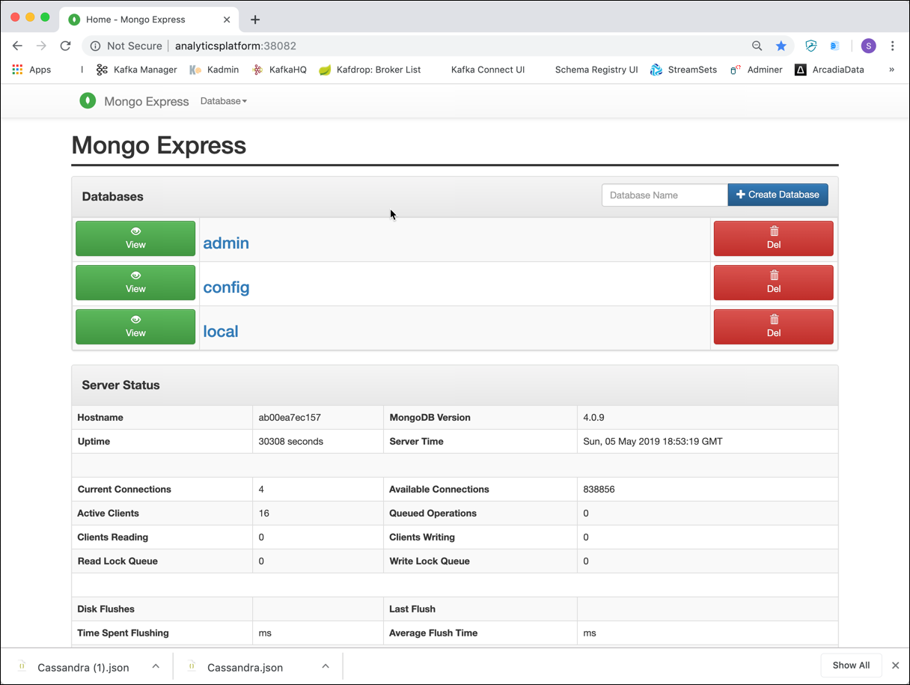

# Working with MongoDB

In this workshop we will learn how to use the MongoDB NoSQL database.

We assume that the platform described [here](../01-environment) is running and accessible. 

## Connecting to the MongoDB environment

### Using the MongoDB Command Line utility

You can find the `mongo` command line utility inside the MongoDB docker container running as part of the platform. Connect via SSH onto the Docker Host and run the following `docker exec` command

```
docker exec -ti mongo-1 mongosh -u "root" -p "abc123!"
```

This will connect you into the `mongo` container and run the `mongo` shell inside it. 

You should see an output similar to this one below. 

```bash
bigdata@bigdata:~$ docker exec -ti mongo-1 mongosh -u "root" -p "abc123!"
Current Mongosh Log ID:6446cf419d459282bba79eebConnecting to:mongodb://<credentials>@127.0.0.1:27017/?directConnection=true&serverSelectionTimeoutMS=2000&appName=mongosh+1.8.0
Using MongoDB:6.0.5
Using Mongosh:1.8.0

For mongosh info see: https://docs.mongodb.com/mongodb-shell/

------
   The server generated these startup warnings when booting 
   2023-04-24T18:06:04.486+00:00: Using the XFS filesystem is strongly recommended with the WiredTiger storage engine. See http://dochub.mongodb.org/core/prodnotes-filesystem
   2023-04-24T18:06:08.233+00:00: vm.max_map_count is too low
------

------
   Enable MongoDB's free cloud-based monitoring service, which will then receive and display
   metrics about your deployment (disk utilization, CPU, operation statistics, etc). 
   
   The monitoring data will be available on a MongoDB website with a unique URL accessible to you
   and anyone you share the URL with. MongoDB may use this information to make product 
   improvements and to suggest MongoDB products and deployment options to you.      
   
   To enable free monitoring, run the following command: db.enableFreeMonitoring()   
   To permanently disable this reminder, run the following command: db.disableFreeMonitoring()
------

test> 
```

You are now at the MongoDB command prompt, ready to execute any MongoDB statements. We can also see the version of the MongoDB server as well as of the MongoDB shell.

The shell runs JavaScript. There are some global commands you can execute, like help or exit. Commands that you execute against the current database are executed against the db object, such as `db.help()` or `db.stats()`. 

Commands that you execute against a specific collection, which is what we’ll be doing a lot of, are executed against the `db.COLLECTION_NAME` object, such as `db.movies.help()` or `db.movies.count()`.

Go ahead and enter `db.help()`, you’ll get a list of commands that you can execute against the db object.

**A small side note:** Because this is a JavaScript shell, if you execute a method and omit the parentheses (), you’ll see the method body rather than executing the method. I only mention it so that the first time you do it and get a response that starts with function (...){  you won’t be surprised. For example, if you enter db.help (without the parentheses), you’ll see the internal implementation of the help method.

### Using browser-based GUI

Instead of working over the command line and therefore having to connect to the Docker Host via SSH, we can also use a browser based GUI to access MongoDB. Two browser-based utilities are available as part of the platform. 

#### Mongo Express 

The first one is [Mongo Express](https://github.com/mongo-express/mongo-express), a Web-based MongoDB admin interface written with Node.js, Express and Bootstrap3.

In a browser window, navigate to <http://dataplatform:28123/> and you should directly arrive on the home screen as shown below. 



#### Admin Mongo
The second one is [Admin Mongo](https://github.com/adicom-systems/adminMongo), an open source admin user interface for your MongoDB.

In a browser window navigate to <http://dataplatform:28124/> and you should directly arrive on the home screen as shown below. 


To connect to the MongoDB instance, add a new connection to Admin Mongo. Enter `Data Platform` into the **Connection name** field and `mongodb://mongo-1:27017` into the **Connection string** field and click **Add connection**. A message should appear saying that the connection has been added successfully.  


A Click on the **Connect** button brings you to the Admin Mongo details page for the connection. 

### Using Desktop Applications

There are also various desktop applications for MongoDB management and administration, which can be downloaded and installed on a Desktop. From there you can connect either to a local or remote Mongo instance.

#### Studio 3T (formerly known as Robo 3T or Robomongo)

The one we are showing here is [Studio 3T](https://robomongo.org/), a desktop application embedding the MongoDB shell. It is available for Windows, Mac and Linux.


Click on the **Connect** icon in the left upper corner and click on **New Connection** to create a new connection. 

Enter `dataplatform` or the IP address of your Docker Host into the **Server** field. Leave the port on 27017 and click on **Save**. With the newly created connection selected, click **Connect**. On the right side you should now see a list of available databases. 

## Working with MongoDB

We begin our journey by getting to know the basic mechanics of working with MongoDB. Obviously this is core to understanding MongoDB, but it should also help us answer higher-level questions about where MongoDB fits.

To get started, there are six simple concepts we need to understand.

 1.	MongoDB has the same concept of a database with which you are likely already familiar (or a schema for you Oracle folks). Within a MongoDB instance you can have zero or more databases, each acting as high-level containers for everything else. 
 2.	A database can have zero or more collections. A collection shares enough in common with a traditional table that you can safely think of the two as the same thing. 
 3.	Collections are made up of zero or more documents. Again, a document can safely be thought of as a row. 
 4.	A document is made up of one or more fields, which you can probably guess are a lot like columns. 
 5.	Indexes in MongoDB function mostly like their RDBMS counterparts. 
 6.	Cursors are different from the other five concepts but they are important enough, and often overlooked, that I think they are worthy of their own discussion. The important thing to understand about cursors is that when you ask MongoDB for data, it returns a pointer to the result set called a cursor, which we can do things to, such as counting or skipping ahead, before actually pulling down data. 

To recap, MongoDB is made up of databases which contain collections. A collection is made up of documents. Each document is made up of fields. Collections can be indexed, which improves lookup and sorting performance. Finally, when we get data from MongoDB we do so through a cursor whose actual execution is delayed until necessary.

Why use new terminology (collection vs. table, document vs. row and field vs. column)? Is it just to make things more complicated? The truth is that while these concepts are similar to their relational database counterparts, they are not identical. The core difference comes from the fact that relational databases define columns at the table level whereas a document-oriented database defines its fields at the document level. That is to say that each document within a collection can have its own unique set of fields. As such, a collection is a dumbed down container in comparison to a table, while a document has a lot more information than a row.

Although this is important to understand, don’t worry if things aren’t yet clear. It won’t take more than a couple of inserts to see what this truly means. Ultimately, the point is that a collection isn’t strict about what goes in it (it’s schema-less). Fields are tracked with each individual document. The benefits and drawbacks of this will be explored in a future chapter.

So let’s get started in the MongoDB Shell. 

First we’ll use the global use helper to switch databases, so go ahead and enter 

```
use filmdb
```

It doesn’t matter that the database doesn’t really exist yet. The first collection that we create will also create the `filmdb` database. Now that you are inside a database, you can start issuing database commands, like `db.getCollectionNames()`. 

```
db.getCollectionNames()
```

You get back an empty array, as there are not yet any collections in the `filmdb` database.

Since collections are schema-less, we don’t explicitly need to create them and we can directly start adding documents to a collection. 

## Creating Movie documents in the `movies` collection

We can simply insert a document into a new collection. To do so, use the `insert` command, supplying it with the document to insert:

Add a document for the movie "Pulp Fiction" to the `movies` collection. The command below can be used from the MongoDB shell. 

```
db.movies.insert (
{ 
    "id": "0110912", 
    "title": "Pulp Fiction",
    "year": 1994,
    "runtime": 154,
    "languages": ["en", "es", "fr"],
    "rating": 8.9,
    "votes": 2084331,
    "genres": ["Crime", "Drama"],
    "plotOutline": "Jules Winnfield (Samuel L. Jackson) and Vincent Vega (John Travolta) are two hit men who are out to retrieve a suitcase stolen from their employer, mob boss Marsellus Wallace (Ving Rhames). Wallace has also asked Vincent to take his wife Mia (Uma Thurman) out a few days later when Wallace himself will be out of town. Butch Coolidge (Bruce Willis) is an aging boxer who is paid by Wallace to lose his fight. The lives of these seemingly unrelated people are woven together comprising of a series of funny, bizarre and uncalled-for incidents.",
    "coverUrl": "https://m.media-amazon.com/images/M/MV5BNGNhMDIzZTUtNTBlZi00MTRlLWFjM2ItYzViMjE3YzI5MjljXkEyXkFqcGdeQXVyNzkwMjQ5NzM@._V1_SY150_CR1,0,101,150_.jpg",
    "actors": [
        { "actorID": "0000619", "name": "Tim Roth"},
        { "actorID": "0001625", "name": "Amanda Plummer"},    
        { "actorID": "0522503", "name": "Laura Lovelace"},         
        { "actorID": "0000237", "name": "John Travolta"},   
        { "actorID": "0000168", "name": "Samuel L. Jackson"},   
        { "actorID": "0482851", "name": "Phil LaMarr"},   
        { "actorID": "0001844", "name": "Frank Whaley"},  
        { "actorID": "0824882", "name": "Burr Steers"},  
        { "actorID": "0000246", "name": "Bruce Willis"}, 
        { "actorID": "0000609", "name": "Ving Rahmes"},         
        { "actorID": "0000235", "name": "Uma Thurman"},
        { "actorID": "0000233", "name": "Quentin Tarantino"}
    ],
    "directors": [
        { "directorID": "0000233", "name": "Quentin Tarantino"}
    ],
    "producers": [
        { "producerID": "0004744", "name": "Lawrence Bender"},
        { "producerID": "0000362", "name": "Danny DeVito"},
        { "producerID": "0321621", "name": "Richard N. Gladstein"},        
        { "producerID": "0787834", "name": "Michael Shamberg"},        
        { "producerID": "0792049", "name": "Stacey Sher"},  
        { "producerID": "0918424", "name": "Bob Weinstein"},  
        { "producerID": "0005544", "name": "Harvey Weinstein"}  
    ]
})
```

after executing the command, you should get back the following result, telling that 1 document has been inserted. 

```
WriteResult({ "nInserted" : 1 })
```

In the graphical tools, most of the time you only have to provide the JSON document, without having to specify the `db.movies.insert()` command. 

The above line is executing insert against the **movies** collection, passing it a single parameter. Internally MongoDB uses a binary serialised JSON format called BSON. Externally, this means that we use JSON a lot, as is the case with our parameters. 

Let's also add the movie "The Matrix"

```
db.movies.insert (
{ 
    "id": "0133093", 
    "title": "The Matrix",
    "year": 1999,
    "runtime": 136,
    "languages": ["en"],
    "rating": 8.7,
    "votes": 1496538,
    "genres": ["Action", "Sci-Fi"],
    "plotOutline": "Thomas A. Anderson is a man living two lives. By day he is an average computer programmer and by night a hacker known as Neo. Neo has always questioned his reality, but the truth is far beyond his imagination. Neo finds himself targeted by the police when he is contacted by Morpheus, a legendary computer hacker branded a terrorist by the government. Morpheus awakens Neo to the real world, a ravaged wasteland where most of humanity have been captured by a race of machines that live off of the humans' body heat and electrochemical energy and who imprison their minds within an artificial reality known as the Matrix. As a rebel against the machines, Neo must return to the Matrix and confront the agents: super-powerful computer programs devoted to snuffing out Neo and the entire human rebellion.",
    "coverUrl": "https://m.media-amazon.com/images/M/MV5BNzQzOTk3OTAtNDQ0Zi00ZTVkLWI0MTEtMDllZjNkYzNjNTc4L2ltYWdlXkEyXkFqcGdeQXVyNjU0OTQ0OTY@._V1_SX101_CR0,0,101,150_.jpg",
    "actors": [
        { "actorID": "0000206", "name": "Keanu Reeves"},
        { "actorID": "0000401", "name": "Laurence Fishburne"},    
        { "actorID": "0005251", "name": "Carrie-Anne Moss"},         
        { "actorID": "0915989", "name": "Hugo Weaving"},   
        { "actorID": "0287825", "name": "Gloria Foster"},   
        { "actorID": "0001592", "name": "Joe Pantoliano"},   
        { "actorID": "0159059", "name": "Marcus Chong"},  
        { "actorID": "0032810", "name": "Julian Arahanga"},  
        { "actorID": "0000246", "name": "Bruce Willis"}, 
        { "actorID": "0000609", "name": "Ving Rahmes"},         
        { "actorID": "0000235", "name": "Uma Thurman"},
        { "actorID": "0000233", "name": "Quentin Tarantino"}
    ],
    "directors": [
        { "directorID": "0905154", "name": "Lana Wachowski"},
        { "directorID": "0905152", "name": "Lilly Wachowski"}
    ],
    "producers": [
        { "producerID": "0075732", "name": "Bruce Berman"},
        { "producerID": "0185621", "name": "Dan Cracchiolo"},
        { "producerID": "0400492", "name": "Carol Hughes"}  
    ]        
})
```

If we execute `db.getCollectionNames()` now, we should see the collection we have just added documents to

```
> db.getCollectionNames()
[ "movies" ]
```

You can now use the `find` command against the **movies** collection to return a list of documents:

```
db.movies.find()
```

In fact what we are executing is actually this statement.

```
db.movies.find({})
```

you can see that an empty document is passed as a parameter. This document will later hold the actually query in order to perform a restriction on the documents returned. An empty document just means return all and is the default. 

To display the results in a nicely formatted way, you can use `pretty()` method

```
db.movies.find().pretty()
```

Notice that, in addition to the data you specified, there’s an `_id` field. Every document must have a unique id field. 
You can either generate one yourself or let MongoDB generate a value for you which has the type `ObjectId`. Most of the time you’ll probably want to let MongoDB generate it for you. By default, the `_id` field is indexed - which can be checked using the `db.persons.getIndexes()` command

```
> db.movies.getIndexes()
[ { "v" : 2, "key" : { "_id" : 1 }, "name" : "_id_" } ]
```

What you’re seeing is the name of the index, the database and collection it was created against and the fields included in the index.


## Creating Actor documents in the `persons` collection

Now let's also add some actors to another, new collection named `persons`. We name it this way, because the same person can have different roles in one or many movies.

Let's first add the actor "Bruce Willis"

```
db.persons.insert (
{ 
    "id": 0000246, 
    "name": "Bruce Willis",
    "headshot": "https://m.media-amazon.com/images/M/MV5BMjA0MjMzMTE5OF5BMl5BanBnXkFtZTcwMzQ2ODE3Mw@@._V1_UY98_CR8,0,67,98_AL_.jpg",
    "birthDate": "1955-03-19",
    "tradeMarks": ['Frequently plays a man who suffered a tragedy, had lost something or had a  crisis of confidence or conscience.',
					  'Frequently plays likeable wisecracking heroes with a moral centre',
					  'Headlines action-adventures, often playing a policeman, hitman or someone in the military',
					  'Often plays men who get caught up in situations far beyond their control',
					  'Sardonic one-liners',
					  'Shaven head',
					  'Distinctive, gravelly voice',
					  'Smirky grin.',
					  'Known for playing cynical anti-heroes with unhappy personal lives'],
    "actedInMovies": [
        { "movieId": "0110912", "title": "Pulp Fiction"},
        { "movieId": "1606378", "title": "A Good Day to Die Hard"},
        { "movieId": "0217869", "title": "Unbreakable"},
        { "movieId": "0377917", "title": "The Fifth Element"},
        { "movieId": "0112864", "title": "Die Hard: With a Vengeance"}
    ]        
})
```

then add the actor "Keanu Reeves"

```
db.persons.insert (
{ 
    "id": 0000206, 
    "name": "Keanu Reeves",
    "headshot": "https://m.media-amazon.com/images/M/MV5BMjA0MjMzMTE5OF5BMl5BanBnXkFtZTcwMzQ2ODE3Mw@@._V1_UY98_CR8,0,67,98_AL_.jpg",
    "birthDate": "1955-03-19",
    "tradeMarks": ['Intense contemplative gaze',
		  'Deep husky voice',
		  'Known for playing stoic reserved characters'],
    "actedInMovies": [
        { "movieId": "0133093", "title": "The Matrix"},
        { "movieId": "0234215", "title": "The Matrix Reloaded"},
        { "movieId": "0111257", "title": "Speed"}
    ]        
})
```

followed by the actress "Sandra Bullock"

```
db.persons.insert (
{ 
    "id": 0000113, 
    "name": "Sandra Bullock",
    "headshot": "https://m.media-amazon.com/images/M/MV5BMTI5NDY5NjU3NF5BMl5BanBnXkFtZTcwMzQ0MTMyMw@@._V1_UX67_CR0,0,67,98_AL_.jpg",
    "birthDate": "1964-07-26",
    "actedInMovies": [
        { "movieId": "2737304", "title": "Bird Box"},
        { "movieId": "0120179", "title": "Speed 2: Cruise Control"},
        { "movieId": "0111257", "title": "Speed"},
        { "movieId": "0212346", "title": "Miss Congeniality"}
    ]        
})
```

and finally we also add "Quentin Tarantino"

```
db.persons.insert (
{ 
    "id": 0000233, 
    "name": "Quentin Tarantino",
    "headshot": "https://m.media-amazon.com/images/M/MV5BMTgyMjI3ODA3Nl5BMl5BanBnXkFtZTcwNzY2MDYxOQ@@._V1_UX67_CR0,0,67,98_AL_.jpg",
    "birthDate": "1963-03-27",
    "tradeMarks": ['Lead characters usually drive General Motors vehicles, particularly Chevrolet and Cadillac, such as Jules 1974 Nova and Vincents 1960s Malibu.',
          'Briefcases and suitcases play an important role in Pulp Fiction (1994), Reservoir Dogs (1992), Jackie Brown (1997), True Romance (1993) and Kill Bill: Vol. 2 (2004).',
          'Makes references to cult movies and television',
          'Frequently works with Harvey Keitel, Tim Roth, Michael Madsen, Uma Thurman, Michael Bowen, Samuel L. Jackson, Michael Parks and Christoph Waltz.',
          'His films usually have a shot from inside an automobile trunk',
          'He always has a Dutch element in his films: The opening tune, Little Green Bag, in Reservoir Dogs (1992) was performed by George Baker Selection and written by Jan Gerbrand Visser and Benjamino Bouwens who are all Dutch. The character Freddy Newandyke, played by Tim Roth is a direct translation to a typical Dutch last name, Nieuwendijk. The code name of Tim Roth is Mr. Orange, the royal color of Holland and the last name of the royal family. The Amsterdam conversation in Pulp Fiction (1994), Vincent Vega smokes from a Dutch tobacco shag (Drum), the mentioning of Rutger Hauer in Jackie Brown (1997), the brides name is Beatrix, the name of the Royal Dutch Queen.',
		  '[The Mexican Standoff] All his movies (including True Romance (1993), which he only wrote and did not direct) feature a scene in which three or more characters are pointing guns at each other at the same time.',
         'Often uses an unconventional storytelling device in his films, such as retrospect (Reservoir Dogs (1992)), non-linear (Pulp Fiction (1994)), or "chapter" format (Kill Bill: Vol. 1 (2003)).',
         'His films will often include one long, unbroken take where a character is  followed around somewhere.'],
    "actedInMovies": [
        { "movieId": "0378194", "title": "Kill Bill: Vol. 2"},
        { "movieId": "0110912", "title": "Speed 2: Cruise Control"},
        { "movieId": "0116367", "title": "From Dusk Till Dawn"},
        { "movieId": "0119396", "title": "Jackie Brown"}
    ]        
})
```

So now let's also check that we have all 4 persons added to the collection

```
db.persons.find()
```

We can also use the `count()` method to return the number of documents within the collection. 

```
db.persons.find().count()
```

Which in that case (because we don't specify a query selector) is the same as 

```
db.persons.count()
```

Note: notice that not all documents are exactly the same. The "Sandra Bullock" document does not contain the `tradeMark` array. The collections are schema-less, there is only a JSON parsing being done and therefore the document has to be valid JSON. Let's see what happens if we are using an invalid document.

```
db.persons.insert (
{ 
    "id: 0000113, 
    "name": "Invalid Actor"
})
```

Notice that we have not properly closed the `id` key (missing "). We will get the following error upon insert

```
> db.persons.insert (
... {
...     "id: 0000113,
2019-05-06T07:03:57.200+0000 E QUERY    [js] SyntaxError: unterminated string literal @(shell):3:4
>     "name": "Invalid Actor"
2019-05-06T07:03:57.202+0000 E QUERY    [js] SyntaxError: missing ; before statement @(shell):1:6
> })
2019-05-06T07:03:57.204+0000 E QUERY    [js] SyntaxError: expected expression, got '}' @(shell):1:0
>
```

So while documents in one collection can be completely different from other documents in that collection, they always have to valid JSON documents. 

## Querying Documents using a Query Selector

So far we have used `find` to retrieve all the documents within a collection. That's fine if you have a limited set of documents like here, but of course if you have million of documents, you need a way to query for just some of the documents. 

In addition to the six concepts we’ve explored, there’s one practical aspect of MongoDB you need to have a good grasp of before moving to more advanced topics, the **query selectors**. 

A MongoDB **query selector** is like the where clause of an SQL statement. As such, you use it when finding, counting, updating and removing documents from collections. A selector is a JSON object, the simplest of which is {} which matches all documents. If we wanted to find all movies for the Action genre, we could use `{ genres:'Action' }`.
 
Before delving too deeply into selectors, let’s set up some additional movies to play with. We will use the Top 50 movies from IMDB, without the two movies we have added already before. We won't add the "full-blown" documents, we only add limited information for each movie. We can again see that MongoDB is "schema-less", in the sense that not all documents have to hold all the information. 

We use the `insertMany` method to add multiple JSON documents at once. 

```
db.movies.insertMany([
	{"id": "0111161", "title": "The Shawshank Redemption", "genres": ["Drama"], "year": 1994, "rating": 9.2, "rank": 1},
	{"id": "0068646", "title": "The Godfather", "genres": ["Crime", "Drama"], "year": 1972, "rating": 9.2, "rank": 2},
	{"id": "0071562", "title": "The Godfather: Part II", "genres": ["Crime", "Drama"], "year": 1974, "rating": 9.0, "rank": 3},
	{"id": "0468569", "title": "The Dark Knight", "genres": ["Action", "Crime", "Drama", "Thriller"], "year": 2008, "rating": 9.0, "rank": 4},
	{"id": "0050083", "title": "12 Angry Men", "genres": ["Drama"], "year": 1957, "rating": 8.9, "rank": 5},
	{"id": "0108052", "title": "Schindler's List", "genres": ["Biography", "Drama", "History"], "year": 1993, "rating": 8.9, "rank": 6},
	{"id": "0167260", "title": "The Lord of the Rings: The Return of the King", "genres": ["Adventure", "Drama", "Fantasy"], "year": 2003, "rating": 8.9, "rank": 7},
	{"id": "0060196", "title": "The Good, the Bad and the Ugly", "genres": ["Western"], "year": 1966, "rating": 8.8, "rank": 9},
	{"id": "0137523", "title": "Fight Club", "genres": ["Drama"], "year": 1999, "rating": 8.8, "rank": 10},
	{"id": "4154796", "title": "Avengers: Endgame", "genres": ["Action", "Adventure", "Fantasy", "Sci-Fi"], "year": 2019, "rating": 8.8, "rank": 11},
	{"id": "0120737", "title": "The Lord of the Rings: The Fellowship of the Ring", "genres": ["Adventure", "Drama", "Fantasy"], "year": 2001, "rating": 8.8, "rank": 12},
	{"id": "0109830", "title": "Forrest Gump", "genres": ["Drama", "Romance"], "year": 1994, "rating": 8.7, "rank": 13},
	{"id": "0080684", "title": "Star Wars: Episode V - The Empire Strikes Back", "genres": ["Action", "Adventure", "Fantasy", "Sci-Fi"], "year": 1980, "rating": 8.7, "rank": 14},
	{"id": "1375666", "title": "Inception", "genres": ["Action", "Adventure", "Sci-Fi", "Thriller"], "year": 2010, "rating": 8.7, "rank": 15},
	{"id": "0167261", "title": "The Lord of the Rings: The Two Towers", "genres": ["Adventure", "Drama", "Fantasy"], "year": 2002, "rating": 8.7, "rank": 16},
	{"id": "0073486", "title": "One Flew Over the Cuckoo's Nest", "genres": ["Drama"], "year": 1975, "rating": 8.7, "rank": 17},
	{"id": "0099685", "title": "Goodfellas", "genres": ["Biography", "Crime", "Drama"], "year": 1990, "rating": 8.7, "rank": 18},
	{"id": "0047478", "title": "Seven Samurai", "genres": ["Adventure", "Drama"], "year": 1954, "rating": 8.6, "rank": 20},
	{"id": "0114369", "title": "Se7en", "genres": ["Crime", "Drama", "Mystery", "Thriller"], "year": 1995, "rating": 8.6, "rank": 21},
	{"id": "0317248", "title": "City of God", "genres": ["Crime", "Drama"], "year": 2002, "rating": 8.6, "rank": 22},
	{"id": "0076759", "title": "Star Wars: Episode IV - A New Hope", "genres": ["Action", "Adventure", "Fantasy", "Sci-Fi"], "year": 1977, "rating": 8.6, "rank": 23},
	{"id": "0102926", "title": "The Silence of the Lambs", "genres": ["Crime", "Drama", "Thriller"], "year": 1991, "rating": 8.6, "rank": 24},
	{"id": "0038650", "title": "It's a Wonderful Life", "genres": ["Drama", "Family", "Fantasy"], "year": 1946, "rating": 8.6, "rank": 25},
	{"id": "0118799", "title": "Life Is Beautiful", "genres": ["Comedy", "Drama", "Romance", "War"], "year": 1997, "rating": 8.6, "rank": 26},
	{"id": "0245429", "title": "Spirited Away", "genres": ["Animation", "Adventure", "Family", "Fantasy", "Mystery"], "year": 2001, "rating": 8.5, "rank": 27},
	{"id": "0120815", "title": "Saving Private Ryan", "genres": ["Drama", "War"], "year": 1998, "rating": 8.5, "rank": 28},
	{"id": "0114814", "title": "The Usual Suspects", "genres": ["Crime", "Mystery", "Thriller"], "year": 1995, "rating": 8.5, "rank": 29},
	{"id": "0110413", "title": "L\u00e9on: The Professional", "genres": ["Action", "Crime", "Drama", "Thriller"], "year": 1994, "rating": 8.5, "rank": 30},
	{"id": "0120689", "title": "The Green Mile", "genres": ["Crime", "Drama", "Fantasy", "Mystery"], "year": 1999, "rating": 8.5, "rank": 31},
	{"id": "0816692", "title": "Interstellar", "genres": ["Adventure", "Drama", "Sci-Fi"], "year": 2014, "rating": 8.5, "rank": 32},
	{"id": "0054215", "title": "Psycho", "genres": ["Horror", "Mystery", "Thriller"], "year": 1960, "rating": 8.5, "rank": 33},
	{"id": "0120586", "title": "American History X", "genres": ["Drama"], "year": 1998, "rating": 8.5, "rank": 34},
	{"id": "0021749", "title": "City Lights", "genres": ["Comedy", "Drama", "Romance"], "year": 1931, "rating": 8.5, "rank": 35},
	{"id": "0034583", "title": "Casablanca", "genres": ["Drama", "Romance", "War"], "year": 1942, "rating": 8.5, "rank": 36},
	{"id": "0064116", "title": "Once Upon a Time in the West", "genres": ["Western"], "year": 1968, "rating": 8.5, "rank": 37},
	{"id": "0253474", "title": "The Pianist", "genres": ["Biography", "Drama", "Music", "War"], "year": 2002, "rating": 8.5, "rank": 38},
	{"id": "0027977", "title": "Modern Times", "genres": ["Comedy", "Drama", "Family", "Romance"], "year": 1936, "rating": 8.5, "rank": 39},
	{"id": "1675434", "title": "The Intouchables", "genres": ["Biography", "Comedy", "Drama"], "year": 2011, "rating": 8.5, "rank": 40},
	{"id": "0407887", "title": "The Departed", "genres": ["Crime", "Drama", "Thriller"], "year": 2006, "rating": 8.5, "rank": 41},
	{"id": "0088763", "title": "Back to the Future", "genres": ["Adventure", "Comedy", "Sci-Fi"], "year": 1985, "rating": 8.5, "rank": 42},
	{"id": "0103064", "title": "Terminator 2: Judgment Day", "genres": ["Action", "Sci-Fi"], "year": 1991, "rating": 8.5, "rank": 43},
	{"id": "2582802", "title": "Whiplash", "genres": ["Drama", "Music"], "year": 2014, "rating": 8.5, "rank": 44},
	{"id": "0110357", "title": "The Lion King", "genres": ["Animation", "Adventure", "Drama", "Family", "Musical"], "year": 1994, "rating": 8.5, "rank": 45},
	{"id": "0047396", "title": "Rear Window", "genres": ["Mystery", "Thriller"], "year": 1954, "rating": 8.5, "rank": 46},
	{"id": "0082971", "title": "Raiders of the Lost Ark", "genres": ["Action", "Adventure"], "year": 1981, "rating": 8.5, "rank": 47},
	{"id": "0172495", "title": "Gladiator", "genres": ["Action", "Adventure", "Drama"], "year": 2000, "rating": 8.5, "rank": 48},
	{"id": "0482571", "title": "The Prestige", "genres": ["Drama", "Mystery", "Sci-Fi", "Thriller"], "year": 2006, "rating": 8.5, "rank": 49},
	{"id": "0078788", "title": "Apocalypse Now", "genres": ["Drama", "War"], "year": 1979, "rating": 8.4, "rank": 50}
])
```

After executing the multi insert, we can check that we have in fact 50 movies in our `movies` collection. 

```
> db.movies.find().count()
50 
```
 
Now that we have data, we can master selectors. `{field: value}` is used to find any documents where field is equal to value. `{field1: value1, field2: value2}` is how we can combine them with **and** semantic. 
The special `$lt`, `$lte`, `$gt`, `$gte` and `$ne` are used for less than, less than or equal, greater than, greater than or equal and not equal operations. 

To get all Family movies, we can perform 

```
db.movies.find({"genres": "Family"})
```

If we want get all movies that weight more than 700 pounds, we could do:

```
db.movies.find({"genres":"Action", "year": { $gte :  2010 } })
```

To find all movies which are **not** of genre **Drama**

```
db.movies.find({"genres": { $ne: "Drama"} })
```

The `$exists` operator can be used for matching the presence or absence of a field

```
db.movies.find({ "plotOutline": { $exists: true} })
```

we can see that only two movies have the `plotOutline` property set. 

The `$in` operator can be used for matching one of several values that we pass as an array

```
db.movies.find({ "genres": { $in: ['Family', 'Mistery']} })
```

which returns all movies in either the `Family` or `Mistery` genre.

If we want to **OR** rather than **AND** several conditions on different fields, we use the `$or` operator and assign to it an array of selectors we want or’d

To find all movies of genre *Music* **OR** which have been published *2012* or later

```
db.movies.find({ $or: [ { "genres":"Music" },  { "year": { $gte :  2012 } } ] })
```

To find all movies of genre *Action* **AND** which have been published *2010* or later **OR** have a rating later than *8.8*

```
db.movies.find({ "genres":"Action", $or: [ { "year": { $gte :  2010 } },  { "rating": { $gt :  8.8 } } ] })
```

There’s something pretty neat going on in our last two examples. You might have already noticed, but the `genres` field is an array. MongoDB supports arrays as first class objects. This is an incredibly handy feature. Once you start using it, you wonder how you ever lived without it. What’s more interesting is how easy selecting based on an array value is: `{ genres: 'Action' }` will return any document where genres has a value of `Action`.

There are more available operators than what we’ve seen so far. These are all described in the [Query Selectors](https://docs.mongodb.com/manual/reference/operator/query/index.html) section of the MongoDB manual. What we’ve covered so far though is the basics you’ll need to get started. It’s also what you’ll end up using most of the time.

We’ve seen how these selectors can be used with the `find` command. But they can also be used with the `remove` command, the `count` command and the `update` command which we’ll spend more time with later on.

The `ObjectId` which MongoDB generated for our `_id` field can be selected like so:

```
db.movies.find( {_id: ObjectId("<the-object-id>")})
```

Make sure to replace the `<the-object-id>` by an actual value of one of the movies you have inserted before. 

## Updating Documents

In its simplest form, update takes two parameters: the selector (where) to use and what updates to apply to fields. Let's say that we want to change the rating of the movie "Fight Club" to 9, you might expect that we should execute:

```
db.movies.update( {"title": "Fight Club"}, {"rating": 9} )
```

in the result (when using the console) we can see that one movies has been updated

```
> db.movies.update( {"title": "Fight Club"}, {"rating": 9} )
WriteResult({ "nMatched" : 1, "nUpserted" : 0, "nModified" : 1 })
```

Now, if we look at the updated record

```
db.movies.find( {title: 'Fight Club'})
```

You should discover the first surprise of `update?. No document is found because the second parameter we supplied didn’t have any update operators, and therefore it was used to **replace** the original document. 

In other words, the update found a document by name and replaced the entire document with the new document (the second parameter). There is no equivalent functionality to this in SQL’s update command. In some situations, this is ideal and can be leveraged for some truly dynamic updates. 

However, when you want to change the value of a field, or add a new field, you must use MongoDB’s `$set` operator. Go ahead and run an update to reset the lost fields. But because we have removed all the fields except of the rating, how can be make sure that we update the correct document?

Let's query the document, without an id field

```
db.movies.find( { "id": { $exists: false } } )
```

We should only get one document, the one we have "destroyed" before. And we can see the `_id` of this document. 

```
> db.movies.find( { "id": { $exists: false } } )
{ "_id" : ObjectId("5ccfec0cc4df88b359a29f9b"), "rating" : 9 }
```

This field we can now use to find the right document, and update it using the `$set` operator

```
db.movies.update( { _id: ObjectId("5ccfec0cc4df88b359a29f9b") },  {$set: { 
				"title" : "Fight Club", 
				"genres" : [ "Drama" ], 
				"year" : 1999, 
				"rank" : 10 } 
				} )
```

This won’t overwrite the new `rating` field since we didn’t specify it. Now if we execute the find again

```
db.movies.find( {title: 'Fight Club'})
```

We can see that we have successfully "recovered" the document and that the `rating` is correctly set to 9. 

Therefore, the correct way to have updated the `rating` in the first place is

```
db.movies.update ( {title: 'Fight Club'} , { $set: {rating: 9} } )
```

In addition to `$set`, we can leverage other operators to do some nifty things. All update operators work on fields - so your entire document won’t be wiped out. For example, the `$inc` operator is used to increment a field by a certain positive or negative amount. 

If we want to increase the votes for the movie "The Matrix", which is currently set to `1496538` as we can easily see using a find

```
db.movies.find( {title: 'The Matrix'}, {"votes":1})
```

*Note:* the second parameter in the find specifies that instead of the complete document we only want to return the `votes` property as we can see in the result (the _id is always returned by default and could be removed by explicitly also specifying `{ _id:0}` in the 2nd parameter). 

```
> db.movies.find( {title: 'The Matrix'}, {"votes":1})
{ "_id" : ObjectId("5ccffa52aff86ec587e35faa"), "votes" : 1496538 }
```

we can execute the following update

```
db.movies.update( {title: 'The Matrix'} , { $inc: {votes: 1} } )
```
check the new result using the same find as above a 2nd time

```
db.movies.find( {title: 'The Matrix'}, {"votes":1})
```

## Performance Optimizations using Indexes

Indexes in MongoDB work a lot like indexes in a relational database: they help improve query and sorting performance. Indexes are created via `createIndex` command. So let's add an index on the title of movies documents. For an ascending index on a field, specify a value of `1`; for descending index, specify a value of `-1`.

```
db.movies.createIndex( {title: 1} );
```

if we know execute a query on the tile, the index will be used

```
db.movies.find ( {title: "The Matrix"} );
```

If we would have a lot more data in the movies collection, we might see a visual difference. But with only 50 movies, that's not the case. However we can use the `explain()` method to view the execution plan of the optimiser.

Adding the `explain` method at the end of the find statement will return the following result

```
> db.movies.find ( {title: "The Matrix"} ).explain();
{
	"queryPlanner" : {
		"plannerVersion" : 1,
		"namespace" : "filmdb.movies",
		"indexFilterSet" : false,
		"parsedQuery" : {
			"title" : {
				"$eq" : "The Matrix"
			}
		},
		"winningPlan" : {
			"stage" : "FETCH",
			"inputStage" : {
				"stage" : "IXSCAN",
				"keyPattern" : {
					"title" : 1
				},
				"indexName" : "title_1",
				"isMultiKey" : false,
				"multiKeyPaths" : {
					"title" : [ ]
				},
				"isUnique" : false,
				"isSparse" : false,
				"isPartial" : false,
				"indexVersion" : 2,
				"direction" : "forward",
				"indexBounds" : {
					"title" : [
						"[\"The Matrix\", \"The Matrix\"]"
					]
				}
			}
		},
		"rejectedPlans" : [ ]
	},
	"serverInfo" : {
		"host" : "ab00ea7ec157",
		"port" : 27017,
		"version" : "4.0.9",
		"gitVersion" : "fc525e2d9b0e4bceff5c2201457e564362909765"
	},
	"ok" : 1
}
```

We can see that the `winningPlan` uses the `title_1` index. 

A unique index can be created by supplying a second parameter and setting `unique` to true. Let's add an index on the `id` field to ensure that it is unique. 

```
db.movies.createIndex( {id: 1}, {unique: true} );
```

If we now try to add one of the movies a 2nd time we get an error:

```
> db.movies.insert( {"id": "0111161", "title": "The Shawshank Redemption", "genres": ["Drama"], "year": 1994, "rating": 9.2, "rank": 1} )
WriteResult({
	"nInserted" : 0,
	"writeError" : {
		"code" : 11000,
		"errmsg" : "E11000 duplicate key error collection: filmdb.movies index: id_1 dup key: { : \"0111161\" }"
	}
})
```

We can list the index we currently have on the `movies` collection using `db.movies.getIndexes()`:

```
> db.movies.getIndexes()
[
	{
		"v" : 2,
		"key" : {
			"_id" : 1
		},
		"name" : "_id_",
		"ns" : "filmdb.movies"
	},
	{
		"v" : 2,
		"unique" : true,
		"key" : {
			"id" : 1
		},
		"name" : "id_1",
		"ns" : "filmdb.movies"
	},
	{
		"v" : 2,
		"key" : {
			"title" : 1
		},
		"name" : "title_1",
		"ns" : "filmdb.movies"
	}
]
```

We can see a total of 3 indices, the two we have just added and a 3rd one on the `_id` field which has been created automatically by MongoDB.


An index can be dropped using the `dropIndex` command. 

```
db.movies.dropIndex( {title: 1} );
```

We can also create a **Compound** Index covering multiple fields, we can create a **Multikey** Index to index the content of an array field and create **Geospatial**, **Text** and **Hashed** Indexes. 

Consult the [MongoDB's documentation](https://docs.mongodb.com/manual/indexes/) to read more about Indexes.  

## Text Search 

MongoDB supports query operations that perform a text search of string content. To perform text search, MongoDB uses a **text index** and the `$text` operator.

To perform text search queries, you must have a text index on your collection. A collection can only have one text search index, but that index can cover multiple fields.

For example you can run the following in a mongo shell to allow text search over the `title` and `plotOutline` fields:

```
db.movies.createIndex ( { title: "text", plotOutline: "text" } )
```

Now let's to a text search for the term "fight"

```
db.movies.find( { $text: { $search: "fight" } } )
```

The `$text` query operator will tokenize the search string using whitespace and most punctuation as delimiters, and perform a logical OR of all such tokens in the search string.
We should get a result with two movies, one Flight Club where the term can be found in the title and another one where the term is used in the `plotOutline`. 

```
db.movies.find( { $text: { $search: "fight" } } )
{ "_id" : ObjectId("5cd011f1a43cf7c3fa9c84b4"), "id" : "0137523", "title" : "Fight Club", "genres" : [ "Drama" ], "year" : 1999, "rating" : 8.8, "rank" : 10 }
{ "_id" : ObjectId("5ccfebc1c4df88b359a29f91"), "id" : "0110912", "title" : "Pulp Fiction", "year" : 1994, "runtime" : 154, "languages" : [ "en", "es", "fr" ], "rating" : 8.9, "genres" : [ "Crime", "Drama" ], "plotOutline" : "Jules Winnfield (Samuel L. Jackson) and Vincent Vega (John Travolta) are two hit men who are out to retrieve a suitcase stolen from their employer, mob boss Marsellus Wallace (Ving Rhames). Wallace has also asked Vincent to take his wife Mia (Uma Thurman) out a few days later when Wallace himself will be out of town. Butch Coolidge (Bruce Willis) is an aging boxer who is paid by Wallace to lose his fight. The lives of these seemingly unrelated people are woven together comprising of a series of funny, bizarre and uncalled-for incidents.", "coverUrl" : "https://m.media-amazon.com/images/M/MV5BNGNhMDIzZTUtNTBlZi00MTRlLWFjM2ItYzViMjE3YzI5MjljXkEyXkFqcGdeQXVyNzkwMjQ5NzM@._V1_SY150_CR1,0,101,150_.jpg", "actors" : [ { "actorID" : 619", "name" : "Tim Roth" }, { "actorID" : 917", "name" : "Amanda Plummer" }, { "actorID" : 173379", "name" : "Laura Lovelace" }, { "actorID" : 159", "name" : "John Travolta" }, { "actorID" : 168", "name" : "Samuel L. Jackson" }, { "actorID" : 482851", "name" : "Phil LaMarr" }, { "actorID" : 1844", "name" : "Frank Whaley" }, { "actorID" : 824882", "name" : "Burr Steers" }, { "actorID" : 166", "name" : "Bruce Willis" }, { "actorID" : 609", "name" : "Ving Rahmes" }, { "actorID" : 157", "name" : "Uma Thurman" }, { "actorID" : 155", "name" : "Quentin Tarantino" } ], "directors" : [ { "directorID" : 155", "name" : "Quentin Tarantino" } ], "producers" : [ { "producerID" : 2532", "name" : "Lawrence Bender" }, { "producerID" : 242", "name" : "Danny DeVito" }, { "producerID" : 107409", "name" : "Richard N. Gladstein" }, { "producerID" : 787834", "name" : "Michael Shamberg" }, { "producerID" : 792049", "name" : "Stacey Sher" }, { "producerID" : 918424", "name" : "Bob Weinstein" }, { "producerID" : 2916", "name" : "Harvey Weinstein" } ] }
```

If we change the term to `fight terrorist` we can see that the search string will be tokenized into `fight` and `terrorist` and all the movies will be returned matching either of the two terms in the `title` or the `plotOutline` field. 

```
db.movies.find( { $text: { $search: "fight terrorist" } } )
```

Therefore we will also get back a 3rd movie, the movie "The Matrix" which uses the word Terrorist in the plot outline.

## Aggregating Data

Aggregation pipeline gives you a way to transform and combine documents in your collection. You do it by passing the documents through a pipeline that’s somewhat analogous to the Unix “pipe” where you send output from one command to another to a third, etc.

The simplest aggregation you are probably already familiar with is the SQL group by expression. We already saw the simple `count()` method, but what if we want to see how many movies we have for the different ratings?

```
db.movies.aggregate( [{$group:{_id:'$rating', total: { $sum:1 }}}]) 
```

In the shell we have the aggregate helper which takes an array of pipeline operators. For a simple count grouped by something, we only need one such operator and it’s called `$group`. This is the exact analog of GROUP BY in SQL where we create a new document with `_id` field indicating what field we are grouping by (here it’s rating) and other fields usually getting assigned results of some aggregation, in this case we `$sum 1` for each document that matches a particular rating. You probably noticed that the `_id` field was assigned `$rating` and not only `rating` - the `$` before a field name indicates that the value of this field from incoming document will be substituted.

What are some of the other pipeline operators that we can use? 

The most common one to use before (and frequently after) `$group` is the `$match` - this is exactly like the find method and it allows us to aggregate only a matching subset of our documents, or to exclude some documents from our result.

In the following example we group by `genres` and count the number of movies for each genre. Because the `genres` field is an array, we first have to use `$unwind` to flatten the array. We also return the minimum, maximum and average rating for each group. The result is sorted by the number of movies per genre in descending order. 

```
db.movies.aggregate([
					{$match: {year:{$gt:2000}}}, 
					{$unwind: "$genres" }, 
					{$group: {_id:'$genres',
					    number :{ $sum:1 },
					    minRating:{$min:'$rating'}, 
					    maxRating:{$max:'$rating'}, 
					    avgRating:{$avg:'$rating'}
					}}, 
					{$sort:{number:-1}} ])
```

Execution should return the following result

```
{ "_id" : "Drama", "number" : 11, "minRating" : 8.5, "maxRating" : 9, "avgRating" : 8.636363636363637 }
{ "_id" : "Adventure", "number" : 7, "minRating" : 8.5, "maxRating" : 8.9, "avgRating" : 8.7 }
{ "_id" : "Fantasy", "number" : 5, "minRating" : 8.5, "maxRating" : 8.9, "avgRating" : 8.74 }
{ "_id" : "Thriller", "number" : 4, "minRating" : 8.5, "maxRating" : 9, "avgRating" : 8.675 }
{ "_id" : "Sci-Fi", "number" : 4, "minRating" : 8.5, "maxRating" : 8.8, "avgRating" : 8.625 }
{ "_id" : "Crime", "number" : 3, "minRating" : 8.5, "maxRating" : 9, "avgRating" : 8.700000000000001 }
{ "_id" : "Action", "number" : 3, "minRating" : 8.7, "maxRating" : 9, "avgRating" : 8.833333333333334 }
{ "_id" : "Biography", "number" : 2, "minRating" : 8.5, "maxRating" : 8.5, "avgRating" : 8.5 }
{ "_id" : "Music", "number" : 2, "minRating" : 8.5, "maxRating" : 8.5, "avgRating" : 8.5 }
{ "_id" : "Mystery", "number" : 2, "minRating" : 8.5, "maxRating" : 8.5, "avgRating" : 8.5 }
{ "_id" : "Comedy", "number" : 1, "minRating" : 8.5, "maxRating" : 8.5, "avgRating" : 8.5 }
{ "_id" : "War", "number" : 1, "minRating" : 8.5, "maxRating" : 8.5, "avgRating" : 8.5 }
{ "_id" : "Animation", "number" : 1, "minRating" : 8.5, "maxRating" : 8.5, "avgRating" : 8.5 }
{ "_id" : "Family", "number" : 1, "minRating" : 8.5, "maxRating" : 8.5, "avgRating" : 8.5 }
```

There is another powerful pipeline operator called `$project` (analogous to the projection we can specify to the find command) which allows you not just to include certain fields, but to create or calculate new fields based on values in existing fields. For example, you can use math operators to add together values of several fields before finding out the average, or you can use string operators to create a new field that’s a concatenation of some existing fields.

This just barely scratches the surface of what you can do with aggregations. Consult the [MongoDB's documentation](https://docs.mongodb.com/manual/core/aggregation-pipeline/index.html) to read more about Aggregation Pipelines.  

## Removing Documents

For removing one or more documents, just use what we have learned about the Query Selectors, but as a parameter to the `remove` command instead of the `find` command. 

If we want to remove a specific document, for example the movie "Fight Club", we can perform

```
db.movies.remove( { "title": "Fight Club" } )
```

The result will show how many documents have been removed:

```
> db.movies.remove( { "title": "Fight Club" } )
WriteResult({ "nRemoved" : 1 })
```

We can see that as expected, only one movie has been removed. If there would have been two movies with the exact same title, then both of them would have been deleted. What if we want to assure that we only want to remove one document and otherwise would like to get an error. We can add the `justOne` argument to the remove, which is set to `false` by default.

```
db.movies.remove( { "title": "The Intouchables" }, { justOne: true } )
```

Now the document is only removed, if the query selector matches exactly one document. 


We can easily also remove the rest of the 48 additional movies we have added before with the following command, specifying to remove all documents where there is no `plotOutline` field. 

```
db.movies.remove( { "plotOutline": { $exists: false} } )
```

