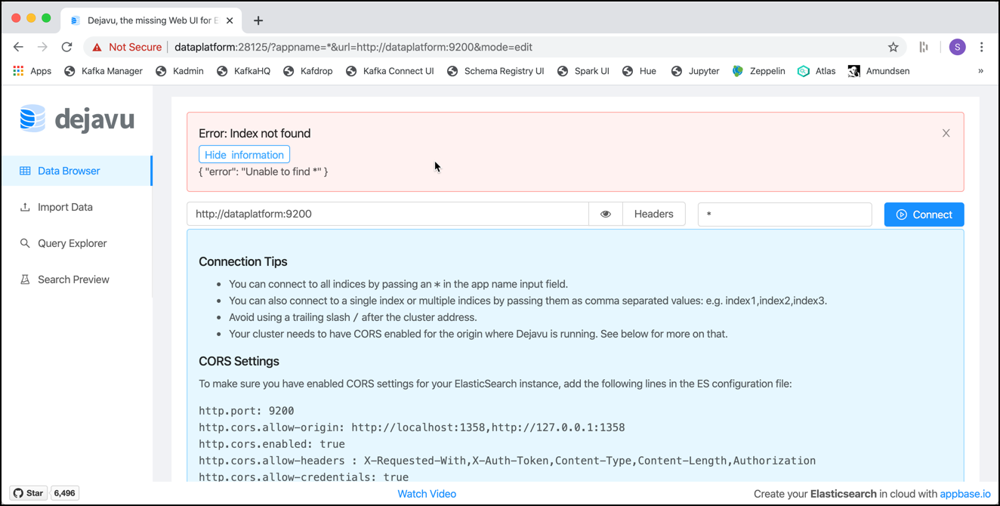

# Working with Elasticsearch

In this workshop we will learn how to use the Elasticsearch NoSQL database.

We assume that the platform described [here](../01-environment) is running and accessible. 

## Connecting to the Elasticsearch environment

### Using REST API

Once you have an instance of Elasticsearch up and running you can talk to it using its JSON based REST API residing at localhost port 9200. You can use any HTTP client to talk to it. In ElasticSearch's own documentation all examples use curl, which makes for concise examples. However, when playing with the API you may find a graphical client such RESTClient more convenient. 

In a browser window, navigate to <http://dataplatform:9200/> just to see that Elastic Search is running. You should see the following result. 


Because most of the commands use another HTTP Method than `GET`, using the browser like shown is only of limited use. 

To have more control over the HTTP method to use, the `curl` command can be used. From a terminal window, use curl and the GET method on the address specified, using JSON for the `Content-Type` header attribute.

```
curl -H "Content-Type: application/json" -XGET http://dataplatform:9200
```

You should get a result similar to the one shown below. 

```
{
  "name" : "_-nptvf",
  "cluster_name" : "docker-cluster",
  "cluster_uuid" : "B_8IYK11RhWryD8QXQOv6Q",
  "version" : {
    "number" : "6.7.0",
    "build_flavor" : "default",
    "build_type" : "docker",
    "build_hash" : "8453f77",
    "build_date" : "2019-03-21T15:32:29.844721Z",
    "build_snapshot" : false,
    "lucene_version" : "7.7.0",
    "minimum_wire_compatibility_version" : "5.6.0",
    "minimum_index_compatibility_version" : "5.0.0"
  },
  "tagline" : "You Know, for Search"
}
``` 

In this workshop we will be using the method with `curl` for most of the times. But there are other browser-based GUIs which can be used as well 

### Using Browser-based GUIs

There are many options to work with Elasticsearch in a browser-based way, which are more comfortable than just the plain browser. 

One option is to use a generic REST client which runs in the browser, such as the Firefox Add-On called RESTClient. 

Another option is to use a specific Elasticsearch GUI application running in a browser. The NoSQL Platform installed for this course contains the ElasticHQ, DejaVu and Cerebro as well as the Kibana application. 

A third option is to use Apache Zeppelin, similar to the Cassandra workshop, which has an Elasticsearch interpreter. 

#### Firefox RESTClient

REST Client is a Firefox Add-on, which can be used to send REST calls similar to the curl above with full-control over HTTP Method and Attributes.

Install the Add-on using the [this link](https://addons.mozilla.org/en-US/firefox/addon/restclient/?src=search). After restarting Firefox it should be available as an icon in the menu in the top right corner. 

Specify the **Method**, **URL** and **Body** fields according to your command and click on **SEND**.


#### Kibana Application

[Kibana](https://www.elastic.co/products/kibana) is part of the Elastic stack (aka. ELK Stack) and lets you visualise your Elasticsearch data and navigate the Elastic Stack. It also holds a Dev Tools interface where you can execute REST calls over a browser based window. 

In a browser window, navigate to <http://dataplatform:5601> and you should directly land on the Kibana home screen as shown below. 


Navigate to **Dev Tools** on the right to open the **Dev Tools Console** window. 

#### ElasticHQ Application

The second one is [ElasticHQ](https://www.elastichq.org/), an open source management and monitoring interface for Elasticsearch.

In a browser window, navigate to <http://dataplatform:28127> and you should directly land on the ElasticHQ **Connect to Elasticsearch** screen. Enter `http://dataplatform:9200` into the URL field and click **Connect**. You should arrive on the ElasticHQ home screen as shown below. 


#### Cerebro Application

The second one is [Cerebro](https://github.com/lmenezes/cerebro/), an open source (MIT License) elasticsearch web admin tool built using Scala, Play Framework, AngularJS and Bootstrap.

In a browser window, navigate to <http://dataplatform:28126/> and you should directly land on the Cerebro **Connect** screen. Enter `http://dataplatform:9200` into the **Node address** field and click **Connect**. You should arrive on the Cerebro home screen as shown below. 


#### Dejavu Application

[Dejavu](https://opensource.appbase.io/dejavu/) is a Web-based UI for Elasticsearch to import, browse and edit data with rich filters & query views.

In a browser window, navigate to <http://dataplatform:28125/> and you should directly arrive on the home screen as shown below. 

Enter `http://dataplatform:9200` into the URL field and `*` into the `Appname` field and then click **Connect**. 

You will get an error, because there is not yet an index available. 



But this proves that the connection to Elasticsearch worked and later, after creating the index, the connect will just work fine.

#### Apache Zeppelin

Another universal "data" tool is [Apache Zeppelin](http://zeppelin.apache.org). In a browser window, navigate to <http://dataplatform:28080/> and you should directly arrive on the home screen as shown below. 


Apache Zeppelin uses a so called "Notebook" based model that enables data-driven,
Interactive data analytics and collaborative documents with SQL, Scala and more.

Zeppelin uses the concept of interpreters. Each Interpreter has the capability to "talk" to a given data systems. When creating a Notebook, you can specify the "default" interpreter to use, all other interpreters can be used as well, but then the directive `%<interpreter-name>`has to be used in each cell. 

Zeppelin has an Elasticsearch interpreter, which we will use here. But before we can use it, it has to be configured. Click on **anonymous** drop-down and select **Interpreter**.

Navigate to the **Elasticsearch** Interpreter either by searching for it or scrolling down to reach it. Click on **edit** and change the **elasticsearch.host** property to `elasticsearch-1`, the **elasticsearch.port** to `9200` and the **elasticsearch.client.type** to `http`. 


Scroll-down to the end of the Interpreter settings and click **Save**. Confirm that you want Zeppelin to restart the Interpreter with the new settings. 

Click on **Zeppelin** in the upper left corner to navigate back to the Home screen. 

Now let's create a new notebook by clicking on the **Create new note** link. On the pop-up window enter `Elasticsearch` into he **Note Name** field and select **elasticsearch** for the **Default Interpreter** and click **Create**.
An empty notebook with one cell will appear. This cell is now ready to be used and has the Elasticsearch interpreted assigned. Enter each command into a separate cell and either click on the **play** icon on the right or hit **Ctrl-Enter** to execute the cell. A new cell will automatically appear when executing the current one. 

For all the commands which follow now in this workshop, you can either use one of the various different options shown above. Of course you an also mix to your liking.

## Create a Mapping

To create the mapping for the year type in Elasticsearch run the following curl command:

```
curl -H "Content-Type: application/json" -XPUT http://dataplatform:9200/movies -d '
{
    "mappings": {
        "movie": {
            "properties": {
                "year": { "type": "date"}
            }
        }
    }
}'
```

and you should get a result similar to the one bellow

```
gus@gusmacbook ~> curl -H "Content-Type: application/json" -XPUT http://dataplatform:9200/movies -d '
                  {
                      "mappings": {
                          "movie": {
                              "properties": {
                                  "year": { "type": "date"}
                              }
                          }
                      }
                  }'

{"acknowledged":true,"shards_acknowledged":true,"index":"movies"}⏎
```

Check that the mapping was correctly loaded by getting it back using the following command:


```
curl -H "Content-Type: application/json" -XGET http://dataplatform:9200/movies/_mapping/movie?pretty
```

## Insert, Update and Delete Operations 
First we use a single movie and see the various modify operations on Elasticsearch. 

### Insert a movie

Let's insert the movie "Pulp Fiction" into the `movies` index we have created before

```
curl -XPUT "http://dataplatform:9200/movies/movie/110912" -H 'Content-Type: application/json' -d'
{
    "id": "110912", 
    "title": "Pulp Fiction",
    "year": 1994,
    "runtime": 154,
    "languages": ["en", "es", "fr"],
    "rating": 8.9,
    "votes": 2084331,
    "genres": ["Crime", "Drama"],
    "plotOutline": "Jules Winnfield (Samuel L. Jackson) and Vincent Vega (John Travolta) are two hit men who are out to retrieve a suitcase stolen from their employer, mob boss Marsellus Wallace (Ving Rhames). Wallace has also asked Vincent to take his wife Mia (Uma Thurman) out a few days later when Wallace himself will be out of town. Butch Coolidge (Bruce Willis) is an aging boxer who is paid by Wallace to lose his fight. The lives of these seemingly unrelated people are woven together comprising of a series of funny, bizarre and uncalled-for incidents.",
    "coverUrl": "https://m.media-amazon.com/images/M/MV5BNGNhMDIzZTUtNTBlZi00MTRlLWFjM2ItYzViMjE3YzI5MjljXkEyXkFqcGdeQXVyNzkwMjQ5NzM@._V1_SY150_CR1,0,101,150_.jpg",
    "actors": [
        { "actorID": "0000619", "name": "Tim Roth"},
        { "actorID": "0001625", "name": "Amanda Plummer"},    
        { "actorID": "0522503", "name": "Laura Lovelace"},         
        { "actorID": "0000237", "name": "John Travolta"},   
        { "actorID": "0000168", "name": "Samuel Jackson"},   
        { "actorID": "0482851", "name": "Phil LaMarr"},   
        { "actorID": "0001844", "name": "Frank Whaley"},  
        { "actorID": "0824882", "name": "Burr Steers"},  
        { "actorID": "0000246", "name": "Bruce Willis"}, 
        { "actorID": "0000609", "name": "Ving Rahmes"},         
        { "actorID": "0000235", "name": "Uma Thurman"},
        { "actorID": "0000233", "name": "Quentin Tarantino"}
    ],
    "directors": [
        { "directorID": "0000233", "name": "Quentin Tarantino"}
    ],
    "producers": [
        { "producerID": "0004744", "name": "Lawrence Bender"},
        { "producerID": "0000362", "name": "Danny DeVito"},
        { "producerID": "0321621", "name": "Richard N. Gladstein"},        
        { "producerID": "0787834", "name": "Michael Shamberg"},        
        { "producerID": "0792049", "name": "Stacey Sher"},  
        { "producerID": "0918424", "name": "Bob Weinstein"},  
        { "producerID": "0005544", "name": "Harvey Weinstein"}  
    ]
}'
```
### Retrieve the movie

You can now use the `GET` http method against the **movies** index to check if the movie has been added to the index.

First let's search for all documents 

```
curl -XGET http://dataplatform:9200/movies/movie/_search
```

We can also tell the REST API to pretty print the results, i.e. where the Json document is nicely formatted

```
curl -XGET http://dataplatform:9200/movies/movie/_search?pretty
```

but of course as we know the id of the document, we can also retrieve specifically that document

```
curl -XGET http://dataplatform:9200/movies/movie/110912
```

### Update the movie

Now let's see how we can update the title of the movie we have stored before. Let's say we want to append the `year` to the `title` field. 

```
curl -H "Content-Type: application/json" -XPOST http://dataplatform:9200/movies/movie/110912/_update?pretty -d '
{
    "doc": {
        "title": "The Matrix (1999)"
    }
}'
```

in the answer we can see that the version of the document has been increase to 2. 

```
bash-3.2$ curl -H "Content-Type: application/json" -XPOST http://dataplatform:9200/movies/movie/110912/_update?pretty -d '
> {
>     "doc": {
>         "title": "The Matrix (1999)"
>     }
> }'
{
  "_index" : "movies",
  "_type" : "movie",
  "_id" : "110912",
  "_version" : 6,
  "result" : "updated",
  "_shards" : {
    "total" : 2,
    "successful" : 1,
    "failed" : 0
  },
  "_seq_no" : 8,
  "_primary_term" : 1
}
```

Let's see if the update was successful

```
curl -XGET http://dataplatform:9200/movies/movie/110912?pretty
```

We can also see the version of the document in the header. 

### Delete the movie

Last but not least let's remove the movie by using the DELETE method on the URI.

```
curl -XDELETE http://dataplatform:9200/movies/movie/110912
```

Let's see if the delete was successful

```
curl -XGET http://dataplatform:9200/movies/movie/110912
```

We should no longer get the document back but instead get a `"found" : false` result

```
bash-3.2$ curl -XGET http://dataplatform:9200/movies/movie/110912?pretty
{
  "_index" : "movies",
  "_type" : "movie",
  "_id" : "110912",
  "found" : false
}
```

## Let's add a few movies

Now let's add some more movies. This time we are using a file to hold the document and reference it from the curl command.

```
curl -XPUT "http://dataplatform:9200/movies/movie/110912" -H 'Content-Type: application/json' --data-binary @$DATAPLATFORM_HOME/../../05-working-with-elasticsearch/data/pulp-fiction.json

curl -XPUT "http://dataplatform:9200/movies/movie/133093" -H 'Content-Type: application/json' --data-binary @$DATAPLATFORM_HOME/../../05-working-with-elasticsearch/data/the-matrix.json

curl -XPUT "http://dataplatform:9200/movies/movie/0137523" -H 'Content-Type: application/json' --data-binary @$DATAPLATFORM_HOME/../../05-working-with-elasticsearch/data/fight-club.json

curl -XPUT "http://dataplatform:9200/movies/movie/0068646" -H 'Content-Type: application/json' --data-binary @$DATAPLATFORM_HOME/../../05-working-with-elasticsearch/data/the-godfather.json

curl -XPUT "http://dataplatform:9200/movies/movie/0120737" -H 'Content-Type: application/json' --data-binary @$DATAPLATFORM_HOME/../../05-working-with-elasticsearch/data/lord-of-the-rings.json

curl -XPUT "http://dataplatform:9200/movies/movie/4154796" -H 'Content-Type: application/json' --data-binary @$DATAPLATFORM_HOME/../../05-working-with-elasticsearch/data/avengers-endgame.json
```

## Analyzers

Firstly let's try some searches. First lets try a match search for 'The Matrix':

```
curl -H "Content-Type: application/json" -XGET http://dataplatform:9200/movies/movie/_search?pretty -d '
{
    "query": {
        "match": { 
            "title": "The Matrix" 
        }
    }
}'
```

You will notice that **The Godfather** and **The Lord of the Rings** is listed as well as **The Matrix**. This is because the analyser used is the default full text / partial match analyser. Additionally, **The Godfather** appears even above (with more relevance) **The Matrix** due to the small number of documents across many shards. A larger corpus of documents will fix/improve the relevancy.

Let's search for a genre of 'sci' as follows

```
curl -H "Content-Type: application/json" -XGET http://dataplatform:9200/movies/movie/_search?pretty -d '
{
    "query": {
        "match_phrase": { 
            "genres": "sci" 
        }
    }
}'
```

You will notice that the results might not be as expected since the results are all films with 'sci' such as 'Sci-Fi'. 

The expected results for requesting a phrase match of 'sci' might be zero documents.

We can fix these issues by specifying analysers to use at the mapping. To do this we need to delete our entire index, update the mapping and reindex the documents again.

To delete the index run this command:

```
curl -H "Content-Type: application/json" -XDELETE http://dataplatform:9200/movies
```

Then update the mappings as follows:

```
curl -H "Content-Type: application/json" -XPUT http://dataplatform:9200/movies -d '
{
    "mappings": {
        "movie": {
            "properties": {
                "id": { "type": "integer"},
                "year": { "type": "date"},
                "genres": { "type": "keyword" },
                "title": { "type": "text", "analyzer": "english"},
                "plotOutline": { "type": "text", "analyzer": "english"}
            }
        }
    }
}'
```

So to recap what just happened here:
 * For string/text fields that should be exact matches then define as a keyword mapping
 * For string/text fields that should be partial matches based on relevance then define as a text mapping together with an optional analyser like 'english'

Now reimport the data

```
curl -XPUT "http://dataplatform:9200/movies/movie/110912" -H 'Content-Type: application/json' --data-binary @$DATAPLATFORM_HOME/../../05-working-with-elasticsearch/data/pulp-fiction.json

curl -XPUT "http://dataplatform:9200/movies/movie/133093" -H 'Content-Type: application/json' --data-binary @$DATAPLATFORM_HOME/../../05-working-with-elasticsearch/data/the-matrix.json

curl -XPUT "http://dataplatform:9200/movies/movie/0137523" -H 'Content-Type: application/json' --data-binary @$DATAPLATFORM_HOME/../../05-working-with-elasticsearch/data/fight-club.json

curl -XPUT "http://dataplatform:9200/movies/movie/0068646" -H 'Content-Type: application/json' --data-binary @$DATAPLATFORM_HOME/../../05-working-with-elasticsearch/data/the-godfather.json

curl -XPUT "http://dataplatform:9200/movies/movie/0120737" -H 'Content-Type: application/json' --data-binary @$DATAPLATFORM_HOME/../../05-working-with-elasticsearch/data/lord-of-the-rings.json

curl -XPUT "http://dataplatform:9200/movies/movie/4154796" -H 'Content-Type: application/json' --data-binary @$DATAPLATFORM_HOME/../../05-working-with-elasticsearch/data/avengers-endgame.json
```
And perform the search for 'The Matrix' again

```
curl -H "Content-Type: application/json" -XGET http://dataplatform:9200/movies/movie/_search?pretty -d '
{
    "query": {
        "match": { 
            "title": "The Matrix" 
        }
    }
}'
``` 

So now our search for a genre of 'sci' will no longer return a result

```
curl -H "Content-Type: application/json" -XGET http://dataplatform:9200/movies/movie/_search?pretty -d '
{
    "query": {
        "match_phrase": { 
            "genres": "sci" 
        }
    }
}'
```

We now have to search for an exact match, for example we can search for 'sci-fi'

```
curl -H "Content-Type: application/json" -XGET http://dataplatform:9200/movies/movie/_search?pretty -d '
{
    "query": {
        "match_phrase": { 
            "genres": "sci-fi" 
        }
    }
}'
```

We still don't get any result. The search is even case sensitive, so it really has to be an exact match, so a search for 'Sci-Fi' will return us the movie

```
curl -H "Content-Type: application/json" -XGET http://dataplatform:9200/movies/movie/_search?pretty -d '
{
    "query": {
        "match_phrase": { 
            "genres": "Sci-Fi" 
        }
    }
}'
```


## Searching in Elasticsearch


### Inserting Top-250 movies

In order to have some more data, we can import the Top 250 rated movies, available in [data/top250-movies.json>](./data/top250-movies.json)

```
curl -H "Content-Type: application/json" -XPUT http://dataplatform:9200/_bulk?pretty --data-binary @$DATAPLATFORM_HOME/../../05-working-with-elasticsearch/data/top250-movies.json
```

### Query Lite / URI Search

Short hand query syntax which can be useful for debugging and testing out search. 

Let's find all movies where the title contains 'matrix'

```
curl http://dataplatform:9200/movies/movie/_search?q=title:matrix 
```

We can include the `explain` parameter, so that for each hit an explanation of how scoring of the hits is computed and returned

```
curl http://dataplatform:9200/movies/movie/_search?q=title:matrix&explain=true
```

Because their is now body needed, you can also directly execute them from a browser


**Note:** Do not use this approach in Production. It's easy to break, URL may need to be encoded, is a security risk, it's very fragile.

For more details, refer to the [Elasticsearch URI Search](https://www.elastic.co/guide/en/elasticsearch/reference/current/search-uri-request.html) documentation.

### Queries and Filters

Things you can do within a query

 * **Query** - need results in order relevance
 * **Filters** - usually for binary type searches. More efficient and faster since they can be cached.

Below is an example using both a Query and a Filter.

In the query below we have a bool query - which is essentially allowing us to combine conditions together. Within the bool query we use a `must` which is essentially the equivalent of an AND logical query. Additionally within the `bool` query we have a filter which further applies a range against the year attribute.

So we basically want to see all the movies which have `star` in the title and have been release after `2010`

```
curl -H "Content-Type: application/json" -XGET http://dataplatform:9200/movies/movie/_search?pretty -d '
{
    "query": {
        "bool": { 
            "must": { "term": { "title": "star" } },
            "filter": { "range": { "year": { "gte": 2000 } }}
        }
    }
}'
```

Types of **filters**:

* `term` - filter by exact values { "term": { "year": 2014 } }
* `terms` - match if any exact values in a list match {"terms": { "genre": ["Sci-Fi", "Adventure"] }}
* `range` - find numbers or dates in a given range { "range": { "year": { "gte": 2010 } }
* `exists` - find documents where the field exists { "exists": { "field": "tags" } }
* `missing` - find documents where the field is missing { "missing": { "field": "tags" } }
* `bool` - combine filters with Boolean logic (must (logical AND), must_not (logical NOT), should (logical OR))

Types of **queries**:

* `match` - searches analysed results such as full-text { "match": { "title": "The Force Awakens" } }
* `multi_match`- run the same query on multiple fields { "multi_match": { "query": "star", "fields": ["title", "synopsis"] }}
* `bool` - same functionality as with filers but the results are scored by relevance

For more details, refer to the [Elasticsearch Query DSL](https://www.elastic.co/guide/en/elasticsearch/reference/7.0/query-dsl.html) documentation.

### Phrase search

Use `match_phrase` and, optionally, `slop. In the following example the search would find the document containing *'NYPD cop John McClane'* because the match_phrase query is 'nypd cop' with a slop of 1.

```
curl -H "Content-Type: application/json" -XGET http://dataplatform:9200/movies/movie/_search?pretty -d '
{
    "query": {
        "match_phrase": { 
            "plotOutline": { "query": "nypd cop", "slop": 1} 
        }
    }
}'
```

For more details, refer to the [Elasticsearch Match Phrase Query](https://www.elastic.co/guide/en/elasticsearch/reference/7.0/query-dsl-match-query-phrase.html) documentation.

### Proximity query

Let's say you want to find documents and give them a higher relevance when certain words are close together, then set the slop to a high number. In the following example the search would find the document containing *'NYPD cop John McClane goes on a Christmas vacation to visit his wife Holly in Los Angeles where she works for the Nakatomi Corporation. While they are at the Nakatomi headquarters for a Christmas party, a group of robber...'* because the match_phrase query is 'cop robber' with a slop of 50.

```
curl -H "Content-Type: application/json" -XGET http://dataplatform:9200/movies/movie/_search?pretty -d '
{
    "query": {
        "match_phrase": { 
            "plotOutline": { "query": "nypd cop robber", "slop": 100} 
        }
    }
}'
```

### Sorting

In a URL Search, sorting can be enabled by adding the `sort` parameter

```
http://localhost:9200/movies/movie/_search?sort=year
```

Sorting works out of the box for things like integers, years etc, but not for text fields that are analysed for full text search because they exist in the inverted index as individual terms and not as the full string.

Trying to sort on `title`

```
http://localhost:9200/movies/movie/_search?sort=title 
```

will result in an error because title is of type text. 

There is a way around this which is to keep a non-analyzed copy of the field. You need to consider this at the mapping/index stage. Here is a mapping example to do this (**Remember:** to apply this you first have to DELETE the current `movies` index, then apply this mapping and re-import the movies data!)

```
curl -H "Content-Type: application/json" -XPUT http://dataplatform:9200/movies -d '
{
    "mappings": {
        "movie": {
            "properties": {
                "id": { "type": "integer"},
                "year": { "type": "date"},
                "genre": { "type": "keyword" },
                "title": { "type": "text", 
                                     "analyzer": "english",
                                     "fields": { "raw": { "type": "keyword" }}}
            }
        }
    }
}'
```

With that in place, the sorting query will work using the `title.raw` field instead of just the `title` field

```
http://localhost:9200/movies/movie/_search?sort=title.raw
```

### Fuzzy Queries

Note the following query will not match any results because 'Pulb Fiction' is spelt incorrectly (the 'b' at the end of Pulb should in fact be a 'p')

```
curl -H "Content-Type: application/json" -XGET http://dataplatform:9200/movies/movie/_search?pretty -d '
{
    "query": {
        "match": { 
            "title": "Pulb Fiction" 
        }
    }
}'
```

For more details, refer to the [Elasticsearch Fuzzy Query](https://www.elastic.co/guide/en/elasticsearch/reference/7.0/query-dsl-fuzzy-query.html) documentation.