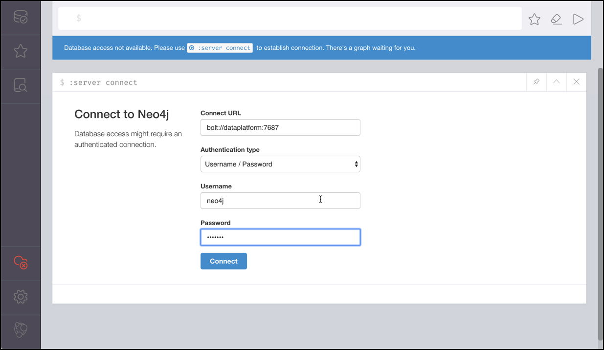
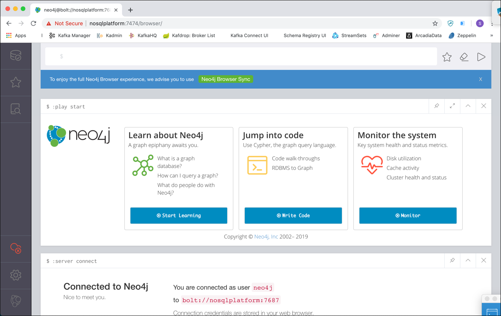
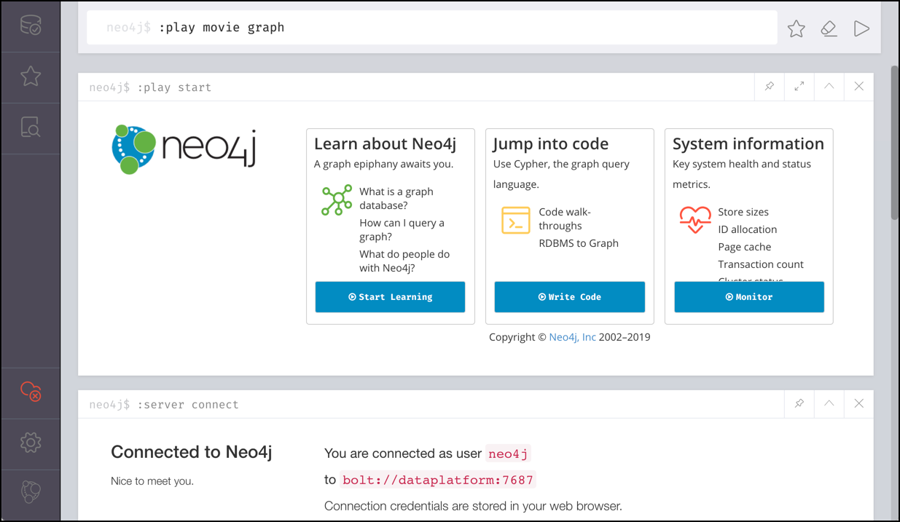
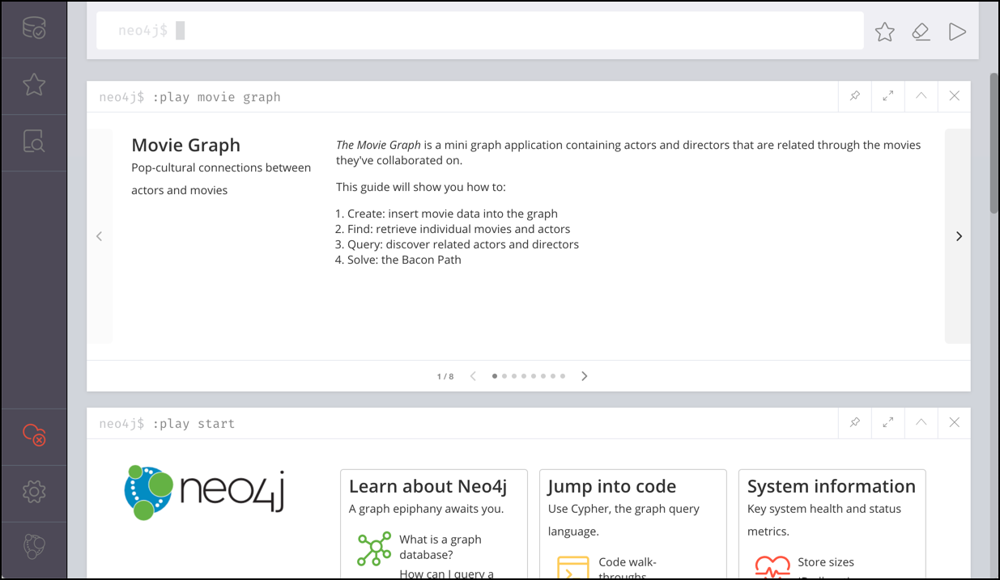
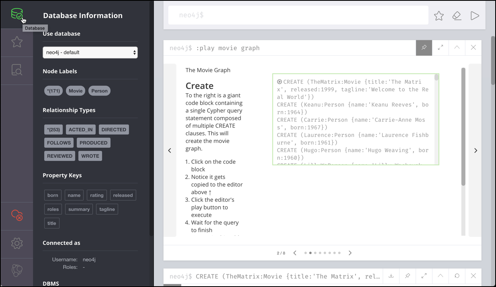
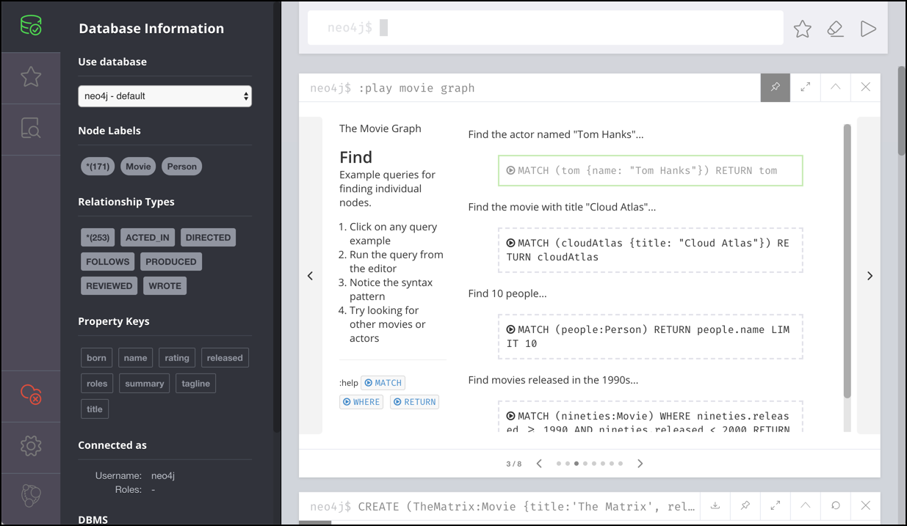
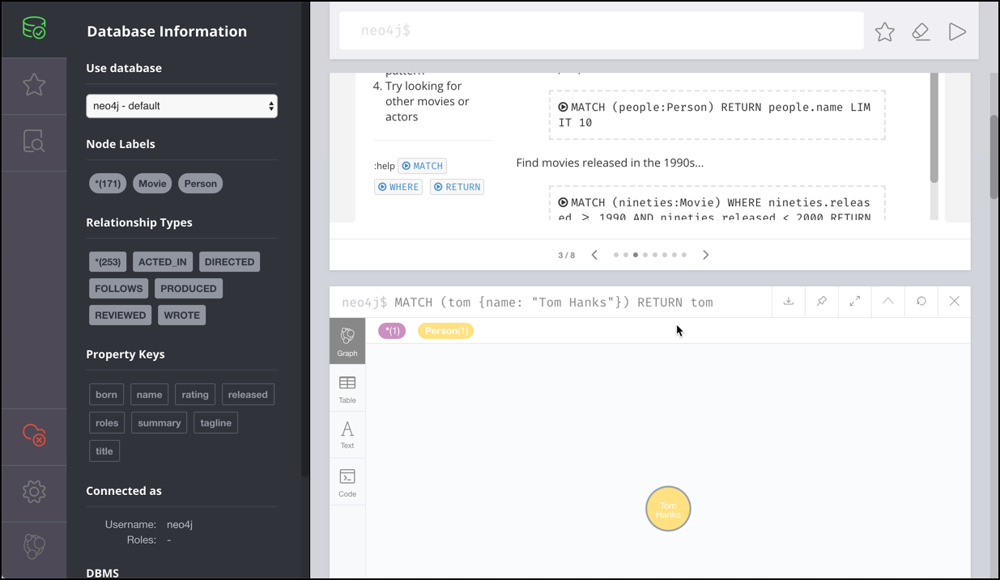
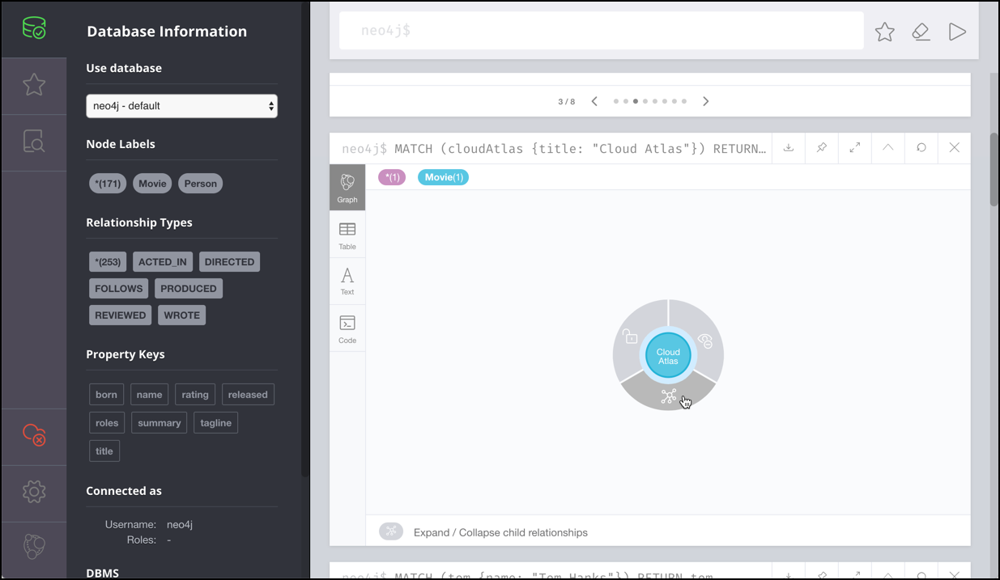
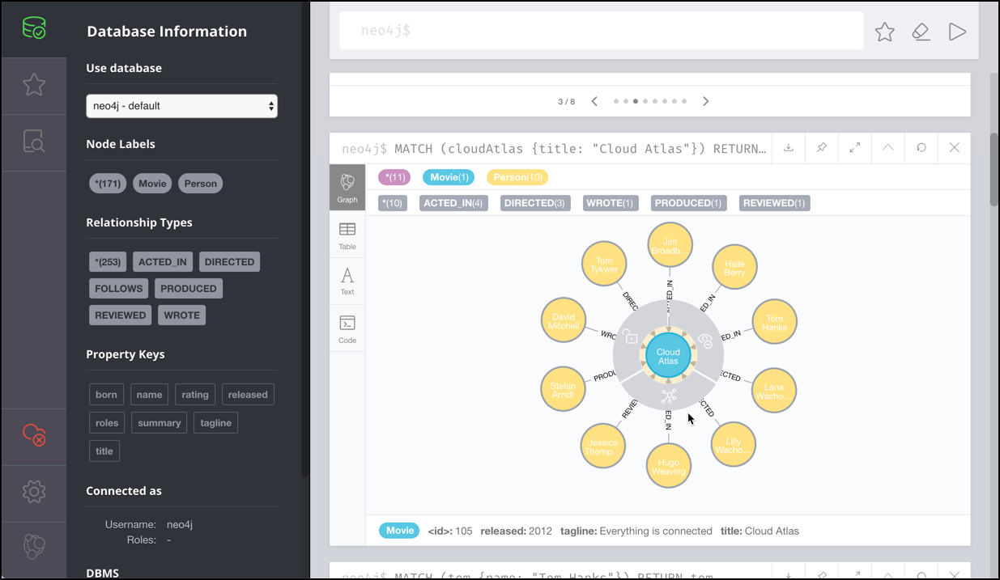
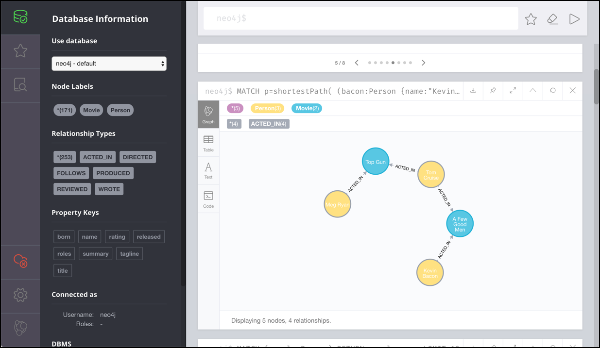

# Working with Neo4J

In this workshop we will learn how to use the Neo4J NoSQL database.

We assume that the platform described [here](../01-environment/README.md) is running and accessible. 

In this workshop you learn how to use Neo4J for querying, visualisation, and data interaction. [Neo4J Browser](https://neo4j.com/developer/guide-neo4j-browser/) is part of Neo4J and offers a browser-based interface for adding data, running queries, creating relationships, and more. It also provides an easy way to visualise the data in the database.


## Connecting to the Cypher Shell (optional)

To use the `cypher-shell`, in a terminal window execute

```bash
docker exec -ti neo4j-1 ./bin/cypher-shell -u neo4j -p abc123abc123
```

and you should get the Neo4J command prompt:

```bash
eadp@eadp-virtual-machine:~$ docker exec -ti neo4j-1 ./bin/cypher-shell -u neo4j -p abc123abc123
Connected to Neo4j using Bolt protocol version 5.2 at neo4j://localhost:7687 as user neo4j.
Type :help for a list of available commands or :exit to exit the shell.
Note that Cypher queries must end with a semicolon.
neo4j@neo4j>
```

Type `:help` to get a list of available commands 

```bash
neo4j@neo4j> :help

Available commands:
  :begin       Open a transaction
  :commit      Commit the currently open transaction
  :connect     Connects to a database
  :disconnect  Disconnects from database
  :exit        Exit the logger
  :help        Show this help message
  :history     Statement history
  :impersonate Impersonate user
  :param       Set the value of a query parameter
  :rollback    Rollback the currently open transaction
  :source      Executes Cypher statements from a file
  :use         Set the active database

For help on a specific command type:
    :help command

Keyboard shortcuts:
    Up and down arrows to access statement history.
    Tab for autocompletion of commands, hit twice to select suggestion from list using arrow keys.

For help on cypher please visit:
    https://neo4j.com/docs/cypher-manual/current/
```

You can also execute any valid Cypher statements. 

Enter `:exit` to leave the CLI.

For the workshop we will be using Neo4J Browser, as it includes an easy way to load a tutorial database.

## Connecting with Neo4J Browser

In a browser window, navigate to <http://dataplatform:7474> and you should directly land on the Neo4j Browser login screen. 



Enter `bolt://dataplatform:7687` into the **Connect URL**, `neo4j` into the **Username** and `abc123abc123` into the **Password** field and click **Connect**. 

If successfully connected, you should see a page similar to the one shown below:



Neo4J comes with some predefined tutorials, which provide an easy way for loading some data into the graph and then using that graph to exercise the query capabilities of the graph. 

On the top panel, enter `:play movie graph` to start the **Movie Graph** tutorial. 



Execute the statement by either hitting ENTER or click on the play arrow on the top right corner.



## Loading the Movie Graph

Use the pin on the Movie Graph panel to pin that panel to the top. We will follow the instructions in this window step by step. Click on the next step in the navigation bar on the bottom of the panel to navigate to 2/8.


Click on the little arrow, left to the `CREATE ..` statement and it should show up in the top panel.

Execute the `CREATE ..` command to create the movie graph and add some sample movie data to play with.  

Before continuing with the next step, let's see how the graph looks like. Click on the database icon on the top left corner of the Neo4J browser.



We can see the different **Node Labels**, the **Relationship Types** and **Property Keys** which have been created for the Movie Graph and how many have been created of each type. 

## Example Queries

Navigate to step 3/8 to find some Cipher statements for finding the information in the graph.



The first statement, finds the actor named "Tom Hanks"

```
MATCH (tom {name: "Tom Hanks"}) RETURN tom
```

Execute it and scroll down to see the result in a graphical way. 



We have only matched on a single Person, therefore only a single node is shown. 

Not let's find the movie with title "Cloud Atlas"...

```
MATCH (cloudAtlas {title: "Cloud Atlas"}) RETURN cloudAtlas
```

The result is similar to the one before, but this time another type of node, a **Movie** node is returned and that's why it is shown in another color. You can click on a node and expand the relationship from/to the **Cloud Atlas** movie node.



Click on expand and you see all nodes related to the movie node



We can see that these are all of type Person (shown by all having the same color). 

Continue with the other statements on the step 3/8 panel and then continue with the other panels. 

You will see many interesting queries, showing the power of a graph database, such as

Show Tom Hanks' co-actors:

```
MATCH (tom:Person {name:"Tom Hanks"})-[:ACTED_IN]->(m)<-[:ACTED_IN]-(coActors) RETURN coActors.name
```

or the Bacon path, the shortest path of any relationships to Meg Ryan

```
MATCH p=shortestPath(
(bacon:Person {name:"Kevin Bacon"})-[*]-(meg:Person {name:"Meg Ryan"})
)
RETURN p
```

the result will show the shortest path from Kevin Bacon to Meg Ryan




