# Working with DataStax Graph

In this workshop we will learn the basics of working with the Gremlin query language. We will use a docker image to work with Gremlin on top of a DataSatax DSE Graph database.

For the workshop you need a docker environment with docker-compose installed on it. Docker Compose provides a way to start multiple docker container in once. 

## Starting DataStax DSE Graph using Docker
In a Docker environment, create a new docker-compose.yml file with the following content:

Add the following two services to the docker-compose.yml file. 

```
  dse:
    image: "datastax/dse-server"
    environment:
      - DS_LICENSE=accept
    command:
     -k
     -s
     -g
    # Allow DSE to lock memory with mlock
    cap_add:
      - IPC_LOCK
    ulimits:
      memlock: -1
    ports:
      - "9042:9042"
    container_name: "dse"
 
  studio:
    image: "datastax/dse-studio"
    environment:
      - DS_LICENSE=accept
    volumes:
      - ./studio:/var/lib/datastax-studio
      - ./conf/studio:/config
    ports:
      - "9091:9091"
    container_name: "studio"

  graph-loader:
    image: trivadis/dse-graphloader
    depends_on:
      - dse
    volumes:
      - ./graph-examples:/graph-examples
    container_name: "graph-loader"
```

Create the network which is used by the docker-compose definition above. 

```
docker network create nosql
```

Create the workspace/datastax folder inside /home/cas 

```
cd /home/bigdata/nosqlplatform
mkdir datastax
cd datastax
```

and download the `graph-examples` folder from the download site.

```
wget "https://www.dropbox.com/s/b4y3pfttetan38n/graph-examples.zip?dl=0"
unzip graph-examples.zip\?dl=0
rm graph-examples.zip\?dl\=0
```

Start the environment using 

```
sudo docker-compose -f docker-compose-datastax.yml up -d
```

If you get a timeout error, then just redo the `docker-compose up -d` command.

With the extension to the docker-compose enviromment, four three additional will be created, a single Cassandra node, an instance of DSE Studio and an instance of the DSE Graph Loader. 

To see the log file of the 4 services running, use the following command

```
sudo docker-compose logs -f dse studio graph-loader
```

## Create a new graph schema in DSE Studio

In order to work with DSE-Graph we will be using the graphical environment DSE Studio. It’s a notebook-style UI provided by DataStax. 

In a browser, connect to http://localhost:9091 inside the Virtual Machine or use the IP Address of the Virtual Machine to connect from externally (i.e. from the host machine). In Azure don’t forget to open the port 9091 and 9042 on the Networking page (add an inbound rule on TCP for port 9091 and for port 9042).

The following page should appear:


click on the **+** icon.

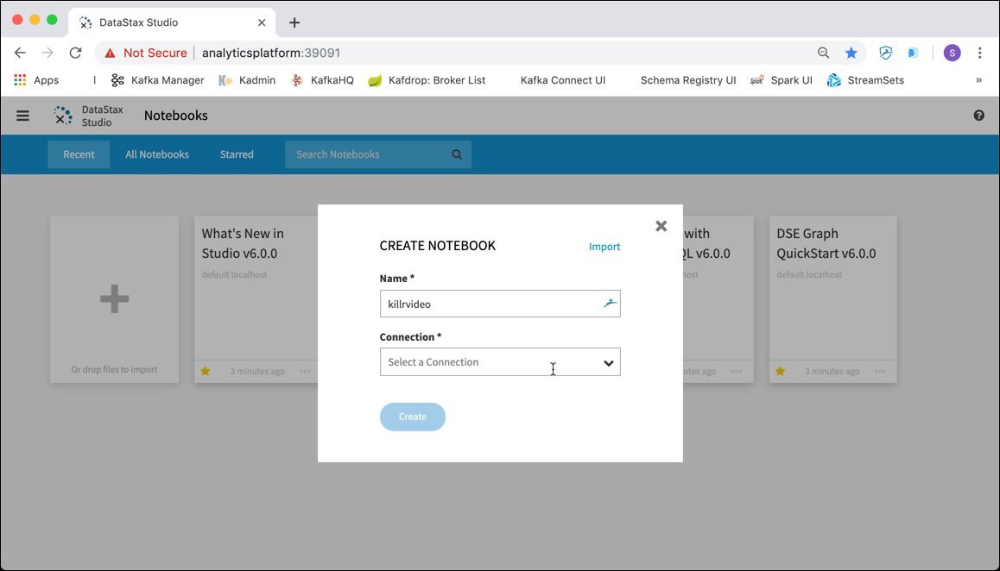

Click on **Connection** drop down and select **Add New Connection**. 


Enter `killrvideo` into the **Name** field and `dse-1` into the **Host/IP** field. Click on **Test** to test if connect to DSE Graph works successfully. 

If you get an error, you might have to make sure that port **9042** is reachable. 

Click **Save** and you are back on the CREATE NOTEBOOK pop-up window. 

Click on the **Select a Graph** drop-down and select **Add New Graph**. 


Enter `killrvideo` into the **Name** field and then click **Create** and once again **Create**.

An empty notebook should appear. That’s your working space.

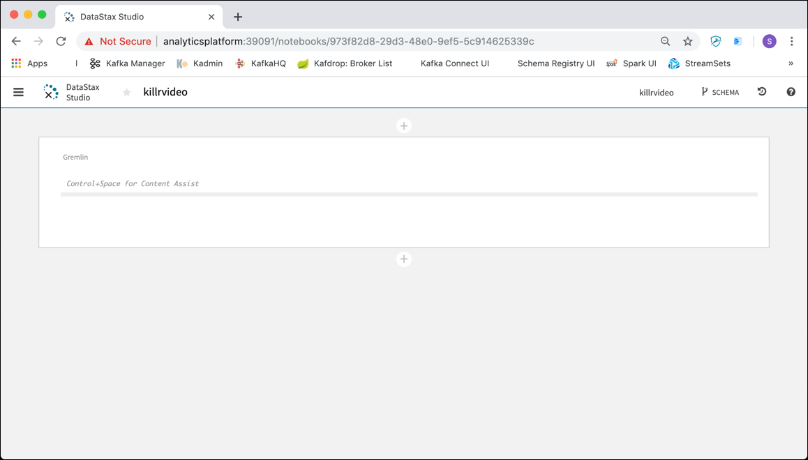
 
## Create the schema

Now we are ready to create the graph schema. The following diagram shows the graph model we are going to implement.

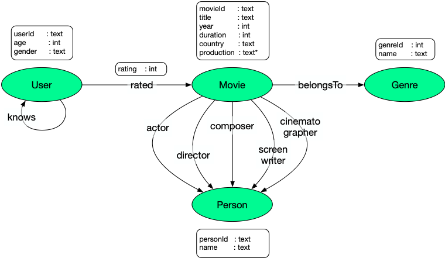

Copy the following code and paste it into the empty cell in the notebook. 
 
```
// Define properties 
schema.propertyKey("genreId").Text().create();
schema.propertyKey("personId").Text().create();
schema.propertyKey("userId").Text().create();
schema.propertyKey("movieId").Text().create();
schema.propertyKey("name").Text().create();
schema.propertyKey("age").Int().create();
schema.propertyKey("gender").Text().create();
schema.propertyKey("title").Text().create();
schema.propertyKey("year").Int().create();
schema.propertyKey("duration").Int().create();
schema.propertyKey("country").Text().create();
schema.propertyKey("production").Text().multiple().create();
schema.propertyKey("rating").Int().create();

// Define vertex labels
schema.vertexLabel("genre").properties("genreId","name").create();
schema.vertexLabel("person").properties("personId","name").create();
schema.vertexLabel("user").properties("userId","age","gender").create();
schema.vertexLabel("movie").properties("movieId","title","year","duration","country","production").create();

// Define edge labels
schema.edgeLabel("knows").connection("user","user").create();
schema.edgeLabel("rated").single().properties("rating").connection("user","movie").create();
schema.edgeLabel("belongsTo").single().connection("movie","genre").create();
schema.edgeLabel("actor").connection("movie","person").create();              // multiple() due to data
schema.edgeLabel("director").single().connection("movie","person").create();
schema.edgeLabel("composer").single().connection("movie","person").create();
schema.edgeLabel("screenwriter").connection("movie","person").create();       // multiple() due to data
schema.edgeLabel("cinematographer").single().connection("movie","person").create();

// Define vertex indexes
schema.vertexLabel("genre").index("genresById").materialized().by("genreId").add();
schema.vertexLabel("genre").index("genresByName").materialized().by("name").add();
schema.vertexLabel("person").index("personsById").materialized().by("personId").add();
schema.vertexLabel("person").index("personsByName").materialized().by("name").add();
schema.vertexLabel("user").index("usersById").materialized().by("userId").add();
schema.vertexLabel("user").index("usersByAge").secondary().by("age").add();
schema.vertexLabel("movie").index("moviesById").materialized().by("movieId").add();
schema.vertexLabel("movie").index("moviesByTitle").materialized().by("title").add();
schema.vertexLabel("movie").index("moviesByYear").secondary().by("year").add();

// Define edge indexes
schema.vertexLabel("user").index("toMoviesByRating").outE("rated").by("rating").add();
schema.vertexLabel("movie").index("toUsersByRating").inE("rated").by("rating").add();
```

The notebook should now look like the diagram below:
 
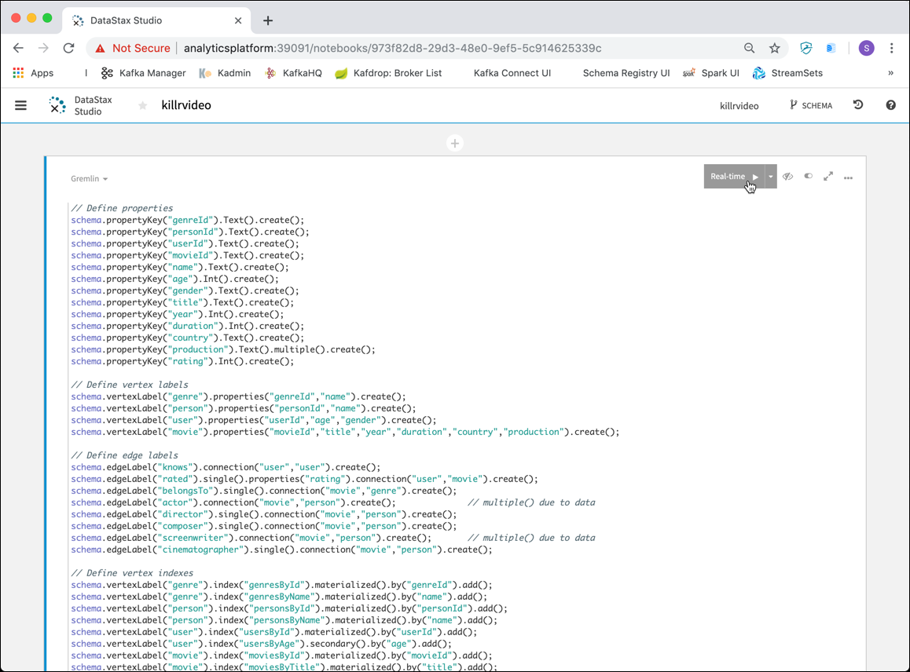

Either click on the **Real-Time >** Button with the arrow in the upper right corner or hit **SHIFT-Enter** to execute the cell. 

It will take a few seconds to create the schema. 

## Load data into the graph

To load the data, we will use the DSE Graph Loader started previously with docker-compose. The folder with the example files has been mapped into the `graph-loader` container as `/graph-examples`. 

```
  graph-loader:
    image: trivadis/dse-graphloader
    container_name: graph-loader
    hostname: graph-loader
    depends_on:
      - dse-1
    volumes:
      - ./graph-examples:/graph-examples
    networks:
      - nosql 
    restart: always
```

Navigate into the running graph-loader docker container

```
docker exec -ti graph-loader bash
```

and change to the `/graph-examples/killrvideo` folder

```
cd /graph-examples/killrvideo/
```

Now start the graph loader using the [`killrvideo-mapping.groovy`](./docker/graph-examples/killrvideo/killrvideo-mapping.groovy) mapping file. 

```
/root/dse-graph-loader-6.7.3/graphloader -address dse-1 killrvideo-mapping.groovy -graph killrvideo -preparation false
``` 

The loader should start importing data which you can see in the log

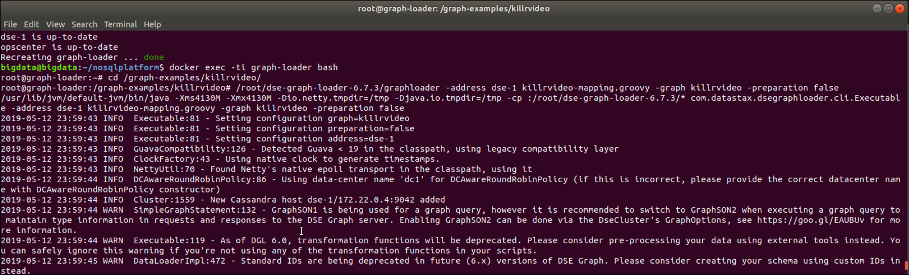

It takes a few minutes for the load to finish. 

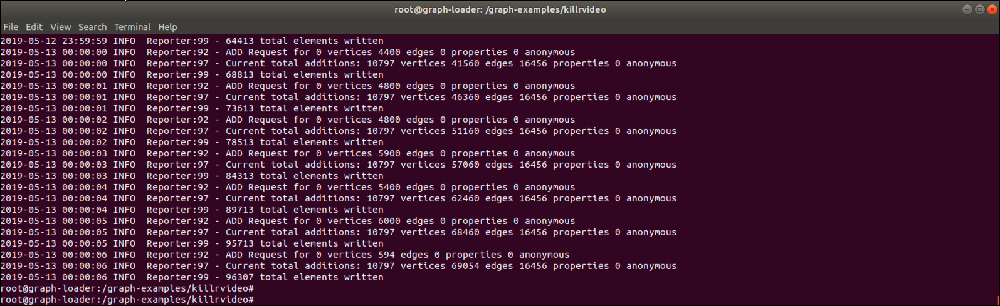
  
## Using the Movie graph

Now with the loaded graph in place, let's start using it. Switch back to the DSE Studio and submit the following Gremlin queries in separate cells. 

### Simple Counts

First let's see how many vertices the graph has in total.  

```
g.V().count()
```

We should get the following error, as the standard settings of DSE Graph does not allow for scanning the whole graph. 

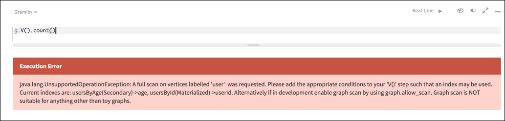
 
You can change this with the `allow_scan` option 

```
schema.config().option('graph.allow_scan').set('true')
```

Now try again, the count the number of vertices should be returned.

```
g.V().count()
```


For each vertex in the graph, emit its label, then group and count each distinct label

```
g.V().label().groupCount()
```


### Simple Graph Traversals

Let’s start with a simple traversal to return the director of the Movie titled `Alice in Wonderland`

```
g. 
  V(). 
      has("title","Alice in Wonderland").     
      has("year",2010). 
      out("director"). 
      values("name")
```
 
We can see that it has been directed by `Tim Burton`.

Now let's both see the director and the screenwriter for this movie. 

```
g. 
  V(). 
      has("title","Alice in Wonderland").     
      has("year",2010). 
      union(__.out("director"),
            out("screenwriter")). 
      values("name")
```

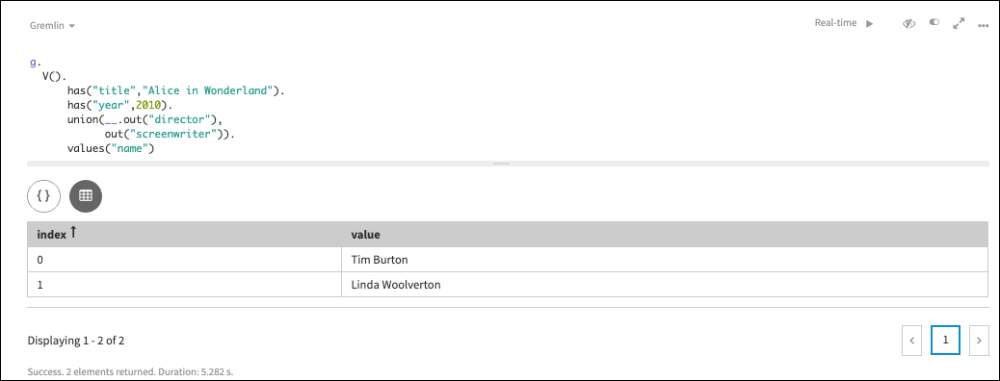

Let's find all movies where `Johnny Depp` acted in and which were released after 2010

```
g.V().
  hasLabel("person").  
  has("name","Johnny Depp").  
  in("actor").  
  has("year",gt(2010)).  
  values("title")
```

We can see 2 movies: `Pirates of the Cribbean: On Stranger Tides` and `Into the Woods`.

Now let's find ages of users who left 7 or 8 star rating for Johnny Depp’s movies released in 2010 or later:

```
g.V().
  hasLabel("person").  
  has("name","Johnny Depp").  
  in("actor").  
  has("year",gte(2010)).  
  inE("rated").
  has("rating", within(7,8)).
  outV().
  values("age")
```


Find Johnny Depp’s movies and display the titles. 

```
g.V().has("person","name","Johnny Depp").
      as("actor"). 
      in("actor").as("movie"). 
      select("actor","movie"). 
      by("name"). 
      by("title")
```

Find Johnny Depp’s movies and display its title, year, and genre

```
g.V().has("person","name","Johnny Depp").
      as("a"). 
      in("actor").as("t","y").
      out("belongsTo").as("g"). 
      select("a","t","y","g"). 
      by("name").by("title").by("year").by("name").
      sample(3)
```

Find directors who appeared in their own movies

```
g.V().match(
     __.as("m").out("actor").as("p"),   
     __.as("m").out("director").as("p")).   
   select("p").by("name").dedup()
```

Of course the result will display `Quentin Tarantino` among others.

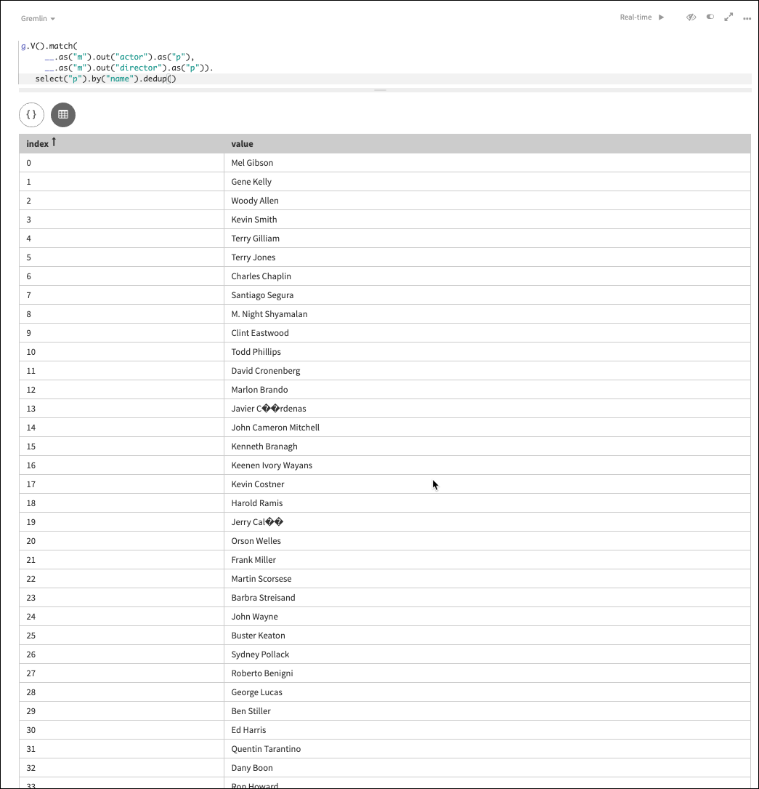


### Outgoing Edges of "Alice in Wonderland"

Now let’s get the movie titled `Alice in Wonderland` and show all out-going Edges:

```
g.V().has("movie","title","Alice in Wonderland").outE()
```

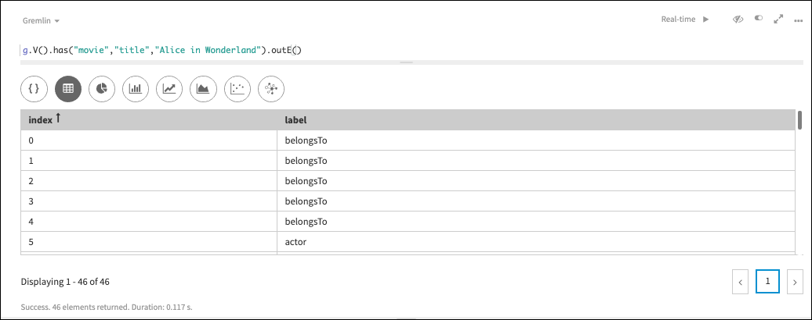

We can still see a grid-style view of the results. But when navigating over edges, we can also switch to a graph style view. Click on the icon to the right (just above the graph).

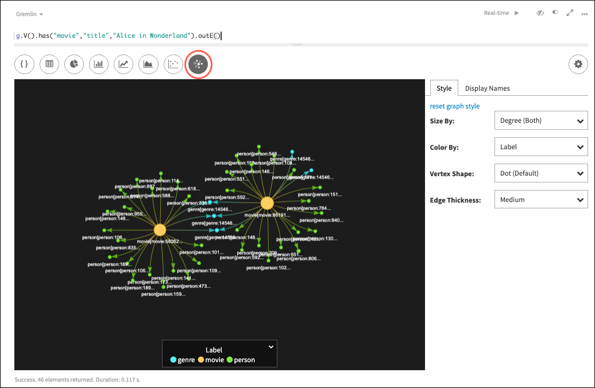

We can see a lot of colored circles, these are the vertices and the links between them, the edges. But we only see the id fields, it would be much better to see some other properties. We can change that by navigating to the Graph Settings` button on the upper right.

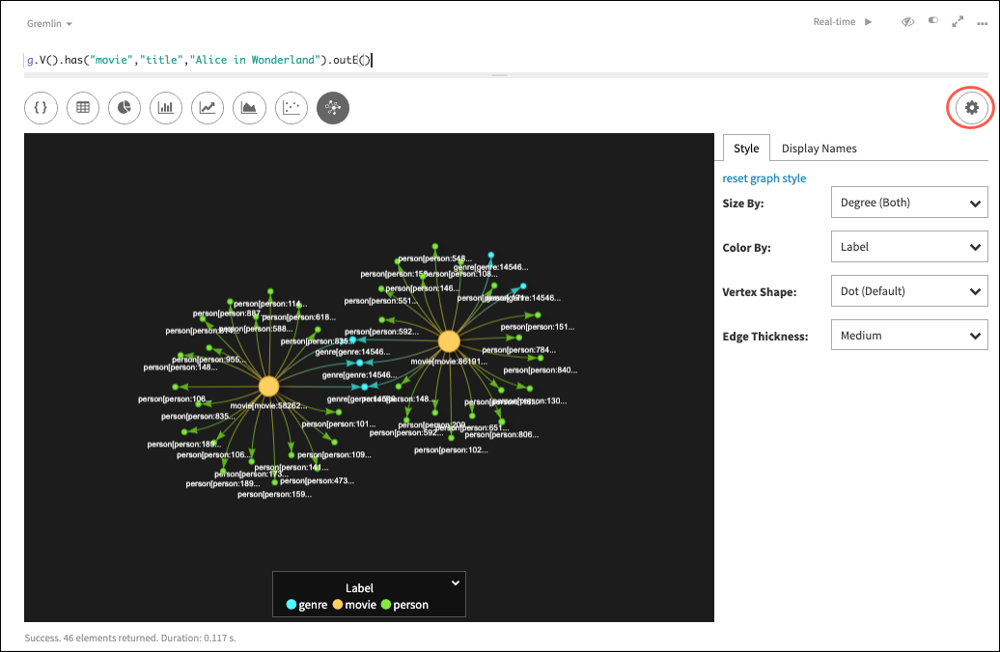

Click on the tab **Display Names** and enter `{{{name}}}` into the **genre** field, `{{{title}}}` into the **movie** field and `{{{name}}}` into the **person** field. You can see that the labels in the graph change accordingly. 

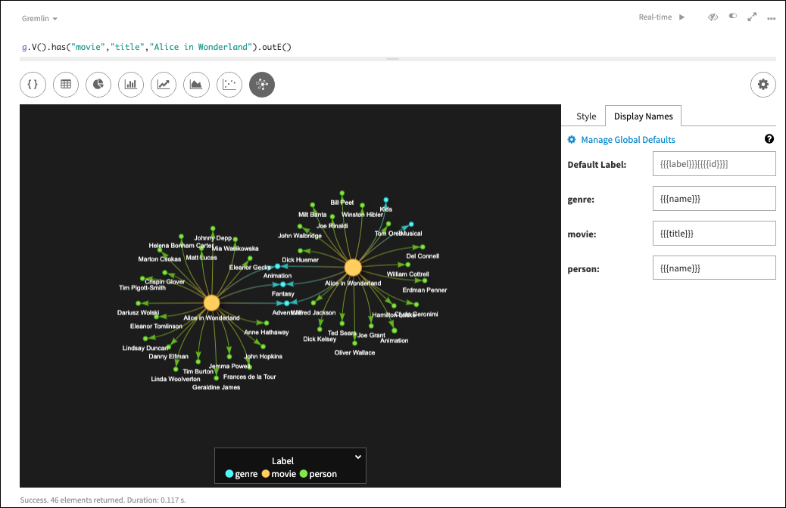

Now we can see that in fact there are two movies titled `Alice in Wonderland`, the yellow circles in the middle with `person` and `genre` vertices around them. We can also see that 3 `genre` vertices are the ones linking the two subgraphs together.

If we navigate the mouse on one of the vertices, you will see a details window pop-up showing the values of all the properties for the given vertex. 
 
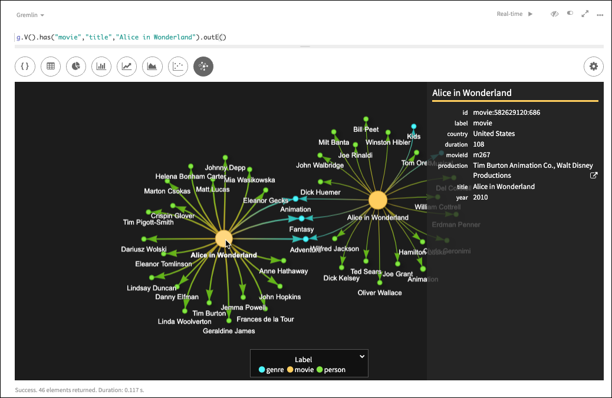

We can now see that these are in fact two different movies with the same title, one published in the year `1951` and the other one in `2010`. We can also see the none of persons were involed in the production of both movies. Both movies are categorized as `Animation`, `Fantasy` and `Adventure`. 

You can also further navigate in the graph. Let's see in what other movies Jonny Depp played by right clicking on his node and select **Expand Neighborhood**.


  
Let's select **actor {13)** for **Edge Labels to Expand** and click on **Add Egeds to View**. 

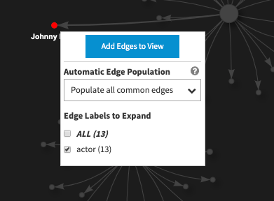

The graph will expand and result in a new graph view. You can manually arange the nodes to make it more visually meaningful


 

### Incoming Edges of "Alice in Wonderland"

Next let’s get all in-coming Edges for the same two movies:

```
g.V().has("movie","title","Alice in Wonderland").inE()
```

Again switch to the graph view and change the display properties. Under **Display Name**, enter `{{{title}}}` into the **movie** field and `{{{label}}}:{{{userId}}}` into the **user** field. This time let's also changge the **Color By** drop-down on the **Style** tab to `Out Degree`.
 


We see the two movies, again in the middle, surrounded by all the users who have reated the two movies.   
Additionally we can easily see that only one of all the users (with id `u185`) has rated both movies. The vertex for the user has a different color, because we have changed the **Color By** setting to `Out Degree`.


