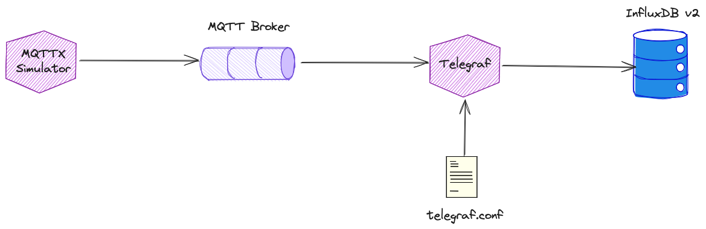

# Working with InfluxDB 2.x

In this workshop we will learn how to use the InfluxDB NoSQL database.

We assume that the platform described [here](../01-environment) is running and accessible. 

For this workshop we will be using an IoT device/sensor simulator available via the [MQTTX CLI](https://mqttx.app/docs/cli) command line client.



## Running the Simulator and publish to MQTT

The MQTT CLI is part of the platform we have started using docker compose. We can use it via `docker exec` command. 

The simulator comes with a few built-in scenarios. To list the available scenarios, in a terminal window execute the following:

```
docker exec -ti mqttx-cli mqttx ls --scenarios
```

and you should see a result similar to

```
~/w/platys-datahub>docker exec -ti mqttx-cli mqttx ls --scenarios                                                               1.303s 23:12
You can use any of the above scenario names as a parameter to run the scenario.
┌───────────────┬──────────────────────────────────────────────────────────────────────────────────────────────┐
│ Scenario Name │ Description                                                                                  │
├───────────────┼──────────────────────────────────────────────────────────────────────────────────────────────┤
│ IEM           │ Simulation to generate Industrial Energy Monitoring data.                                    │
├───────────────┼──────────────────────────────────────────────────────────────────────────────────────────────┤
│ smart_home    │ Simulation to generate Smart Home data.                                                      │
├───────────────┼──────────────────────────────────────────────────────────────────────────────────────────────┤
│ tesla         │ Simulation to generate Tesla's data, reference form https://github.com/adriankumpf/teslamate │
├───────────────┼──────────────────────────────────────────────────────────────────────────────────────────────┤
│ weather       │ Simulation to generate advanced weather station's data.                                      │
└───────────────┴──────────────────────────────────────────────────────────────────────────────────────────────┘
~/w/platys-datahub>
```

we will be using the `smart_home` scenario. 

To run it, use the `simulate` option and specify with `conn` the MQTT broker to connect to. We are running `mosquitto` as part of the platform and this is the one we are connecting to.

```
docker exec -ti mqttx-cli mqttx simulate -sc smart_home -c 100 conn  -h 'mosquitto-1' -p 1883
```

##Using an MQTT Client to view messages

For viewing the messages in MQTT, there are many options available.

In this workshop we will present two alternative options for consuming from MQTT

 * use dockerized MQTT client in the terminal
 * use browser-based HiveMQ Web UI

Using dockerized MQTT Client

To start consuming using through a command line, perform the following docker command from another terminal window:

```
docker run -it --network nosql-platform --rm efrecon/mqtt-client mosquitto_sub -h mosquitto-1 -p 1883 -t mqttx/simulate/#
```

The consumed messages will show up on the terminal window as shown below.


## Using HiveMQ Web UI

To start consuming using the MQTT UI (HiveMQ Web UI), navigate to <http://dataplatform:28136> and connect using `dataplatform` for the Host field, `9101` for the Port field


and click on Connect to connect to the broker.

When successfully connected, click on Add New Topic Subscription and enter truck/+/position into Topic field


and click Subscribe:


You should again see the messages as they are being sent to MQTT.

Alternatively you can also use the [MQTTX Desktop](https://mqttx.app/downloads) version, available for installation on Mac or Windows.

In the subscription pattern of we have used `mqttx/simulate/#`, where  the # symbol is a wildcard used in topic subscriptions to match multiple levels in the topic hierarchy. It's known as the multi-level wildcard. It's important to note that # can only be used as the last character in a topic string, and only one # can be used in a single subscription.

If we check one of the messages, we can see that they are in JSON format, although all one one single line:

```json
{"home_id":"88a76b99-6e22-4771-90cd-aba57deb1015","owner_name":"Erik O'Connell","address":"518 Ullrich Mall","rooms":[{"room_type":"living room","temperature":20,"humidity":47,"lights_on":true,"window_open":false},{"room_type":"bedroom","temperature":22,"humidity":39,"lights_on":true,"window_open":false,"bed_occupancy":false},{"room_type":"kitchen","temperature":19,"humidity":34,"lights_on":true,"window_open":true,"fridge_temperature":7,"oven_on":true},{"room_type":"bathroom","temperature":24,"humidity":50,"lights_on":true,"window_open":true,"water_tap_running":true,"bath_water_level":91}],"timestamp":1714807284732}
```

if we "pretty-print" it then it is more visible

```json
{
   "home_id":"88a76b99-6e22-4771-90cd-aba57deb1015",
   "owner_name":"Erik O'Connell",
   "address":"518 Ullrich Mall",
   "rooms":[
      {
         "room_type":"living room",
         "temperature":20,
         "humidity":47,
         "lights_on":true,
         "window_open":false
      },
      {
         "room_type":"bedroom",
         "temperature":22,
         "humidity":39,
         "lights_on":true,
         "window_open":false,
         "bed_occupancy":false
      },
      {
         "room_type":"kitchen",
         "temperature":19,
         "humidity":34,
         "lights_on":true,
         "window_open":true,
         "fridge_temperature":7,
         "oven_on":true
      },
      {
         "room_type":"bathroom",
         "temperature":24,
         "humidity":50,
         "lights_on":true,
         "window_open":true,
         "water_tap_running":true,
         "bath_water_level":91
      }
   ],
   "timestamp":1714807284732
}
```

We can see that one message of the `smart_home` simulator contains messages for one home with multiple rooms, each providing `temperature`, `humidity` and some other metrics. 

Let's use Telegraf to retrieve them from MQTT and store it in InfluxDB. 

## Configure Telegraf with a access token

Telegraf, a server-based agent, collects and sends metrics and events from databases, systems, and IoT sensors. Written in Go, Telegraf compiles into a single binary with no external dependencies–requiring very minimal memory.

```bash
docker exec -ti influxdb2 influx auth create --org demo --all-access -json
```

and you should get a result similar to the one below

```bash
{
	"id": "0cfd131eaba79000",
	"description": "",
	"token": "bBo79sGHUDsod6Q1gjGyFyzIUF00R_34Yeejq7TExJeoDIeYL7jBlq-UHjaiaqPZJhRBHKD-FfSJAY7EAYcDww==",
	"status": "active",
	"userName": "influx",
	"userID": "0cfcae9de46ba000",
	"permissions": [
		"read:orgs/63799b4b94cf2ec2/authorizations",
		"write:orgs/63799b4b94cf2ec2/authorizations",
		"read:orgs/63799b4b94cf2ec2/buckets",
		"write:orgs/63799b4b94cf2ec2/buckets",
		"read:orgs/63799b4b94cf2ec2/dashboards",
		"write:orgs/63799b4b94cf2ec2/dashboards",
		"read:/orgs/63799b4b94cf2ec2",
		"read:orgs/63799b4b94cf2ec2/sources",
		"write:orgs/63799b4b94cf2ec2/sources",
		"read:orgs/63799b4b94cf2ec2/tasks",
		"write:orgs/63799b4b94cf2ec2/tasks",
		"read:orgs/63799b4b94cf2ec2/telegrafs",
		"write:orgs/63799b4b94cf2ec2/telegrafs",
		"read:/users/0cfcae9de46ba000",
		"write:/users/0cfcae9de46ba000",
		"read:orgs/63799b4b94cf2ec2/variables",
		"write:orgs/63799b4b94cf2ec2/variables",
		"read:orgs/63799b4b94cf2ec2/scrapers",
		"write:orgs/63799b4b94cf2ec2/scrapers",
		"read:orgs/63799b4b94cf2ec2/secrets",
		"write:orgs/63799b4b94cf2ec2/secrets",
		"read:orgs/63799b4b94cf2ec2/labels",
		"write:orgs/63799b4b94cf2ec2/labels",
		"read:orgs/63799b4b94cf2ec2/views",
		"write:orgs/63799b4b94cf2ec2/views",
		"read:orgs/63799b4b94cf2ec2/documents",
		"write:orgs/63799b4b94cf2ec2/documents",
		"read:orgs/63799b4b94cf2ec2/notificationRules",
		"write:orgs/63799b4b94cf2ec2/notificationRules",
		"read:orgs/63799b4b94cf2ec2/notificationEndpoints",
		"write:orgs/63799b4b94cf2ec2/notificationEndpoints",
		"read:orgs/63799b4b94cf2ec2/checks",
		"write:orgs/63799b4b94cf2ec2/checks",
		"read:orgs/63799b4b94cf2ec2/dbrp",
		"write:orgs/63799b4b94cf2ec2/dbrp",
		"read:orgs/63799b4b94cf2ec2/notebooks",
		"write:orgs/63799b4b94cf2ec2/notebooks",
		"read:orgs/63799b4b94cf2ec2/annotations",
		"write:orgs/63799b4b94cf2ec2/annotations",
		"read:orgs/63799b4b94cf2ec2/remotes",
		"write:orgs/63799b4b94cf2ec2/remotes",
		"read:orgs/63799b4b94cf2ec2/replications",
		"write:orgs/63799b4b94cf2ec2/replications"
	]
}
```

Get the value from the `token` property and add it as the `PLATYS_INFLUXDB_TOKEN` environment variable to the `.env` file. 

```bash
~/w/nosql-workshop/01-environment/docker>cat .env                                                                                                         17:57
PLATYS_INFLUXDB_TOKEN=6Lv_ywMeuGfLOv4wa0aUz3uGOFPHERPGTOF4GsXobyYgEGIag2D3q8CJ0a91VTakjMtUp3nUuufGOJxrDe_32A==
```

Remove and restart the `telegraf` container

```bash
docker stop telegraf && docker rm telegraf && docker compose up -d telegraf
```

A `docker logs -f telegraf` should show no errors

```bash
~/D/G/g/d/c/excel-sheet>docker logs -f telegraf                                                venv 406.571s (main|✚?) 18:07
2024-05-04T16:07:13Z I! Loading config: /etc/telegraf/telegraf.conf
2024-05-04T16:07:13Z W! DeprecationWarning: Option "perdevice" of plugin "inputs.docker" deprecated since version 1.18.0 and will be removed in 2.0.0: use 'perdevice_include' instead
2024-05-04T16:07:13Z I! Starting Telegraf 1.28.5 brought to you by InfluxData the makers of InfluxDB
2024-05-04T16:07:13Z I! Available plugins: 240 inputs, 9 aggregators, 29 processors, 24 parsers, 59 outputs, 5 secret-stores
2024-05-04T16:07:13Z I! Loaded inputs: cpu docker prometheus syslog system
2024-05-04T16:07:13Z I! Loaded aggregators:
2024-05-04T16:07:13Z I! Loaded processors:
2024-05-04T16:07:13Z I! Loaded secretstores:
2024-05-04T16:07:13Z I! Loaded outputs: influxdb_v2
2024-05-04T16:07:13Z I! Tags enabled: host=telegraf
2024-05-04T16:07:13Z W! Deprecated inputs: 0 and 1 options
2024-05-04T16:07:13Z I! [agent] Config: Interval:5s, Quiet:false, Hostname:"telegraf", Flush Interval:5s
2024-05-04T16:07:13Z I! [inputs.prometheus] Using the label selector:  and field selector:
```

## Using Telegraf to retrieve values from MQTT and store in InfluxDB

For that we define which plugins Telegraf will use in the `telegraf.conf` configuration file. Each configuration file needs at least one enabled input plugin (where the metrics come from) and at least one enabled output plugin (where the metrics go).

We will use the [MQTT consumer](https://docs.influxdata.com/telegraf/v1/plugins/#input-mqtt_consumer) input plugin and the [InfluxDB_v2](https://docs.influxdata.com/telegraf/v1/plugins/#output-influxdb_v2) output plugin. 

Navigate to the `data-transfer` folder and create a file named `telegraf.conf`. 

```bash
cd $DATAPLATFORM_HOME/data-transfer
nano telegraf.conf
```

Add the following configuration to the empty file

```conf
# Configuration for telegraf agent
[agent]
  ## Default data collection interval for all inputs
  interval = "10s"
  ## Rounds collection interval to 'interval'
  ## ie, if interval="10s" then always collect on :00, :10, :20, etc.
  round_interval = true

  ## Telegraf will send metrics to outputs in batches of at most
  ## metric_batch_size metrics.
  ## This controls the size of writes that Telegraf sends to output plugins.
  metric_batch_size = 1000

  ## Maximum number of unwritten metrics per output.  Increasing this value
  ## allows for longer periods of output downtime without dropping metrics at the
  ## cost of higher maximum memory usage.
  metric_buffer_limit = 10000

  ## Collection jitter is used to jitter the collection by a random amount.
  ## Each plugin will sleep for a random time within jitter before collecting.
  ## This can be used to avoid many plugins querying things like sysfs at the
  ## same time, which can have a measurable effect on the system.
  collection_jitter = "0s"

  ## Default flushing interval for all outputs. Maximum flush_interval will be
  ## flush_interval + flush_jitter
  flush_interval = "10s"
  ## Jitter the flush interval by a random amount. This is primarily to avoid
  ## large write spikes for users running a large number of telegraf instances.
  ## ie, a jitter of 5s and interval 10s means flushes will happen every 10-15s
  flush_jitter = "0s"

  ## By default or when set to "0s", precision will be set to the same
  ## timestamp order as the collection interval, with the maximum being 1s.
  ##   ie, when interval = "10s", precision will be "1s"
  ##       when interval = "250ms", precision will be "1ms"
  ## Precision will NOT be used for service inputs. It is up to each individual
  ## service input to set the timestamp at the appropriate precision.
  ## Valid time units are "ns", "us" (or "µs"), "ms", "s".
  precision = ""

  ## Log at debug level.
  debug = true
  ## Log only error level messages.
  # quiet = false

  ## Log target controls the destination for logs and can be one of "file",
  ## "stderr" or, on Windows, "eventlog".  When set to "file", the output file
  ## is determined by the "logfile" setting.
  # logtarget = "file"

  ## Name of the file to be logged to when using the "file" logtarget.  If set to
  ## the empty string then logs are written to stderr.
  # logfile = ""

  ## The logfile will be rotated after the time interval specified.  When set
  ## to 0 no time based rotation is performed.  Logs are rotated only when
  ## written to, if there is no log activity rotation may be delayed.
  # logfile_rotation_interval = "0d"

  ## The logfile will be rotated when it becomes larger than the specified
  ## size.  When set to 0 no size based rotation is performed.
  # logfile_rotation_max_size = "0MB"

  ## Maximum number of rotated archives to keep, any older logs are deleted.
  ## If set to -1, no archives are removed.
  # logfile_rotation_max_archives = 5

  ## Pick a timezone to use when logging or type 'local' for local time.
  ## Example: America/Chicago
  # log_with_timezone = ""

  ## Override default hostname, if empty use os.Hostname()
  hostname = ""
  ## If set to true, do no set the "host" tag in the telegraf agent.
  omit_hostname = false

[[outputs.influxdb_v2]]
  ## The URLs of the InfluxDB cluster nodes.
  ##
  ## Multiple URLs can be specified for a single cluster, only ONE of the
  ## urls will be written to each interval.
  ##   ex: urls = ["https://us-west-2-1.aws.cloud2.influxdata.com"]
  urls = ["http://influxdb2:8086"]

  ## Token for authentication.
  token = "$INFLUXDB_TOKEN"

  ## Organization is the name of the organization you wish to write to; must exist.
  organization = "demo"

  ## Destination bucket to write into.
  bucket = "demo-bucket"

  ## The value of this tag will be used to determine the bucket.  If this
  ## tag is not set the 'bucket' option is used as the default.
  # bucket_tag = ""

  ## If true, the bucket tag will not be added to the metric.
  # exclude_bucket_tag = false

  ## Timeout for HTTP messages.
  # timeout = "5s"

# Read metrics from MQTT topic(s)
[[inputs.mqtt_consumer]]
  ## Broker URLs for the MQTT server or cluster.  To connect to multiple
  ## clusters or standalone servers, use a separate plugin instance.
  ##   example: servers = ["tcp://localhost:1883"]
  ##            servers = ["ssl://localhost:1883"]
  ##            servers = ["ws://localhost:1883"]
  servers = ["tcp://mosquitto-1:1883"]

  ## Topics that will be subscribed to.
  topics = [
    "mqttx/simulate/#",
  ]

  ## The message topic will be stored in a tag specified by this value.  If set
  ## to the empty string no topic tag will be created.
  topic_tag = ""

  ## Username and password to connect MQTT server.
  # username = "telegraf"
  # password = "metricsmetricsmetricsmetrics"

  ## Data format to consume.
  ## Each data format has its own unique set of configuration options, read
  ## more about them here:
  ## https://github.com/influxdata/telegraf/blob/master/docs/DATA_FORMATS_INPUT.md
  data_format = "json_v2"

  [[inputs.mqtt_consumer.json_v2]]
      measurement_name = "smart_home" # A string that will become the new measurement name
      timestamp_path = "timestamp" # A string with valid GJSON path syntax to a valid timestamp (single value)
      timestamp_format = "unix_ms" # A string with a valid timestamp format (see below for possible values)

    [[inputs.mqtt_consumer.json_v2.tag]]
      path = "home_id" # A string with valid GJSON path syntax
      rename = "id" # A string with a new name for the tag key
      type = "string" # A string specifying the type (int,uint,float,string,bool)
      optional = false # true: suppress errors if configured path does not exist

    [[inputs.mqtt_consumer.json_v2.tag]]
      path = "owner_name" # A string with valid GJSON path syntax
      rename = "owner" # A string with a new name for the tag key
      type = "string" # A string specifying the type (int,uint,float,string,bool)
      optional = false # true: suppress errors if configured path does not exist

    [[inputs.mqtt_consumer.json_v2.object]]
      path = "rooms"
```

With that in place, let's start the telegraf service. We can use the `telegraf` docker container running as part of the platform. It is currently running with a default configuration file, which retrieves metrics from docker and sends them to InfluxDB. We could use Platys (the docker compose generator tool) to change the `docker-compose.yml` to use our new `telegraf.conf` configuration file. But instead we just use the container to start a 2nd telegraf job. In a terminal window, execute the following `docker exec ...` command:

```bash
docker exec -ti telegraf telegraf --config ./data-transfer/telegraf.conf
```

You should see an output similar to the one below

```
~/w/platys-datahub>docker exec -ti telegraf telegraf --config ./data-transfer/telegraf.conf                                      9.22s 20:04
2024-05-04T18:04:28Z I! Loading config: ./data-transfer/telegraf.conf
2024-05-04T18:04:28Z I! Starting Telegraf 1.28.5 brought to you by InfluxData the makers of InfluxDB
2024-05-04T18:04:28Z I! Available plugins: 240 inputs, 9 aggregators, 29 processors, 24 parsers, 59 outputs, 5 secret-stores
2024-05-04T18:04:28Z I! Loaded inputs: mqtt_consumer
2024-05-04T18:04:28Z I! Loaded aggregators:
2024-05-04T18:04:28Z I! Loaded processors:
2024-05-04T18:04:28Z I! Loaded secretstores:
2024-05-04T18:04:28Z I! Loaded outputs: influxdb_v2
2024-05-04T18:04:28Z I! Tags enabled: host=telegraf
2024-05-04T18:04:28Z I! [agent] Config: Interval:10s, Quiet:false, Hostname:"telegraf", Flush Interval:10s
2024-05-04T18:04:28Z D! [agent] Initializing plugins
2024-05-04T18:04:28Z D! [agent] Connecting outputs
2024-05-04T18:04:28Z D! [agent] Attempting connection to [outputs.influxdb_v2]
2024-05-04T18:04:28Z D! [agent] Successfully connected to outputs.influxdb_v2
2024-05-04T18:04:28Z D! [agent] Starting service inputs
2024-05-04T18:04:28Z I! [inputs.mqtt_consumer] Connected [tcp://mosquitto-1:1883]
2024-05-04T18:04:38Z D! [outputs.influxdb_v2] Buffer fullness: 0 / 10000 metrics
2024-05-04T18:04:48Z D! [outputs.influxdb_v2] Buffer fullness: 0 / 10000 metrics
```

Because debug is enabled in the `telegraf.conf` we see additional output whenever data is flushed to InfluxDB.

## Query Data in InfluxDB

In this section we will see how to query data stored in InfluxDB using InfluxQL and Flux. There are multiple ways to query data from InfluxDB including the InfluxDB UI, CLI, and API.

  * **InfluxQL (Influx Query Language)** is the query language originally developed for InfluxDB 1.x. It's a SQL-like language specifically designed for querying time-series data stored in InfluxDB.
  * **Flux** is a data scripting and query language introduced in InfluxDB 2.0. Flux uses functional language patterns making it incredibly powerful, flexible, and able to overcome many of the limitations of InfluxQL.

However InfluxDB v3 uses SQL as the query language with support for InfluxQL. But it is not clear what the future of Flux will be and if it will be supported by InfluxDB v3.  

### Query data with InfluxQL

The influx CLI provides an InfluxQL shell where you can execute InfluxQL queries in an interactive Read-Eval-Print-Loop (REPL).

Use the following command to start an InfluxQL shell:

```bash
docker exec -ti influxdb2 influx v1 shell
```

```sql
show databases;
```

and you should see the buckets, with the `demo-bucket` used in this workshop

```
Interactive Table View (press q to exit mode, shift+up/down to navigate tables):
Name: databases
┏━━━━━━━┳━━━━━━━━━━━━━┓
┃ index ┃    name     ┃
┣━━━━━━━╋━━━━━━━━━━━━━┫
┃      1┃_monitoring  ┃
┃      2┃_tasks       ┃
┃      3┃demo-bucket  ┃
┣━━━━━━━┻━━━━━━━━━━━━━┫
┃   2 Columns, 3 Rows,┃
┃             Page 1/1┃
┃ Table 1/1, Statement┃
┃                  1/1┃
┗━━━━━━━━━━━━━━━━━━━━━┛
```

To see what measurements are available the database `demo-bucket`

```sql
show measurements on "demo-bucket"; 
```

You should find the `smart_home` measurement in the result.

Now we can execute an InfluxQL query inside the InfluxQL shell to show the `temperature` and `humidity` values from the `smart_home` measurement. 

```sql
select temperature, humidity from "demo-bucket".autogen.smart_home;
```
and you should see an output similar to the one below

```bash
Interactive Table View (press q to exit mode, shift+up/down to navigate tables):
Name: smart_home
┏━━━━━━━┳━━━━━━━━━━━━━━━━━━━━━━━━━━━━━━━━┳━━━━━━━━━━━━━━━┳━━━━━━━━━━━━━━━┓
┃ index ┃              time              ┃  temperature  ┃   humidity    ┃
┣━━━━━━━╋━━━━━━━━━━━━━━━━━━━━━━━━━━━━━━━━╋━━━━━━━━━━━━━━━╋━━━━━━━━━━━━━━━┫
┃      1┃  1714847578792000000.0000000000┃  21.0000000000┃  34.0000000000┃
┃      2┃  1714847578792000000.0000000000┃  22.0000000000┃  47.0000000000┃
┃      3┃  1714847578792000000.0000000000┃  26.0000000000┃  40.0000000000┃
┃      4┃  1714847578792000000.0000000000┃  18.0000000000┃  44.0000000000┃
┃      5┃  1714847578792000000.0000000000┃  22.0000000000┃  32.0000000000┃
┃      6┃  1714847578792000000.0000000000┃  19.0000000000┃  39.0000000000┃
┃      7┃  1714847578817999872.0000000000┃  22.0000000000┃  44.0000000000┃
┃      8┃  1714847578817999872.0000000000┃  22.0000000000┃  31.0000000000┃
┃      9┃  1714847578817999872.0000000000┃  26.0000000000┃  48.0000000000┃
┃     10┃  1714847578817999872.0000000000┃  22.0000000000┃  36.0000000000┃
┃     11┃  1714847578817999872.0000000000┃  20.0000000000┃  36.0000000000┃
┃     12┃  1714847578820999936.0000000000┃  23.0000000000┃  46.0000000000┃
┃     13┃  1714847578820999936.0000000000┃  19.0000000000┃  46.0000000000┃
┃     14┃  1714847578920999936.0000000000┃  21.0000000000┃  42.0000000000┃
┃     15┃  1714847578921999872.0000000000┃  18.0000000000┃  40.0000000000┃
┃     16┃  1714847578921999872.0000000000┃  22.0000000000┃  45.0000000000┃
┃     17┃  1714847578921999872.0000000000┃  21.0000000000┃  43.0000000000┃
┃     18┃  1714847578921999872.0000000000┃  26.0000000000┃  35.0000000000┃
┃     19┃  1714847579036999936.0000000000┃  21.0000000000┃  47.0000000000┃
┃     20┃  1714847579038000128.0000000000┃  18.0000000000┃  40.0000000000┃
┃     21┃  1714847579038000128.0000000000┃  24.0000000000┃  36.0000000000┃
┃     22┃  1714847579038000128.0000000000┃  21.0000000000┃  32.0000000000┃
┃     23┃  1714847579038000128.0000000000┃  23.0000000000┃  37.0000000000┃
┃     24┃  1714847579039000064.0000000000┃  19.0000000000┃  49.0000000000┃
┃     25┃  1714847579105999872.0000000000┃  22.0000000000┃  35.0000000000┃
┃     26┃  1714847579121999872.0000000000┃  20.0000000000┃  48.0000000000┃
┃     27┃  1714847579127000064.0000000000┃  26.0000000000┃  32.0000000000┃
┃     28┃  1714847579127000064.0000000000┃  24.0000000000┃  50.0000000000┃
┃     29┃  1714847579142000128.0000000000┃  25.0000000000┃  37.0000000000┃
┃     30┃  1714847579142000128.0000000000┃  22.0000000000┃  38.0000000000┃
┃     31┃  1714847579142000128.0000000000┃  20.0000000000┃  35.0000000000┃
┃     32┃  1714847579142000128.0000000000┃  24.0000000000┃  46.0000000000┃
┃     33┃  1714847579144000000.0000000000┃  19.0000000000┃  42.0000000000┃
┃     34┃  1714847579145999872.0000000000┃  24.0000000000┃  36.0000000000┃
┣━━━━━━━┻━━━━━━━━━━━━━━━━━━━━━━━━━━━━━━━━┻━━━━━━━━━━━━━━━┻━━━━━━━━━━━━━━━┫
┃                                     4 Columns, 242739 Rows, Page 1/7140┃
┃                                                Table 1/1, Statement 1/1┃
┗━━━━━━━━━━━━━━━━━━━━━━━━━━━━━━━━━━━━━━━━━━━━━━━━━━━━━━━━━━━━━━━━━━━━━━━━┛
```

you can use the cursor up and down to navigate in the result. 


### Query data with Flux from the Influx UI

Visit <dataplatform:19999> in a browser to log in and access the InfluxDB UI. Enter `influx` into the **Username** field and `abc123abc123!` into the **Password** field and click **SIGN IN**.

In the left navigation bar, click **Data Explorer**.


The InfluxDB Data Explorer provides two options for querying data with Flux:

 * **Query Builder (default)**: Visual query builder that lets you select the time range, measurement, tags, and fields to query.
 * **Script Editor**: In-browser code editor for composing and running Flux scripts.

We will use the **Query Builder** to build and execute a Flux query. 

1. In the **FROM** column, select the bucket to query. Select the **demo-bucket** bucket.
2. In the next filter column, select **_measurement** from the column dropdown menu, and then select the **smart_home** measurement.
3. To query a specific field or fields, in the next filter column, select **_field** from the column dropdown menu, and then select the fields to query. We use two fields: **temperature** and **humidity**.
4. To query by specific tag values, in the next filter column, select then tag column from the column dropdown menu, and then select the tag values to filter by. Here we want to filter by the Owner, so select the **owner** value and then click on some owners to see their data.
5. In the time range dropdown menu, select **Past 5m**
6. Click **SUBMIT** to execute the query with the selected filters and operations and display the result.

The result should look similar to the screen below


Click on **SCRIPT EDITOR** to switch to the Flux editor. You can see the Flux script generated through the visual query builder:

```
from(bucket: "demo-bucket")
  |> range(start: v.timeRangeStart, stop: v.timeRangeStop)
  |> filter(fn: (r) => r["_measurement"] == "smart_home")
  |> filter(fn: (r) => r["_field"] == "temperature")
  |> filter(fn: (r) => r["owner"] == "Aaron Wiegand" or r["owner"] == "Abraham Goodwin")
  |> aggregateWindow(every: v.windowPeriod, fn: mean, createEmpty: false)
  |> yield(name: "mean")
```

You can navigate back to the query builder by clicking on **QUERY BUILDER**.

Click **SAVE AS** to save the visualization as a dashboard cell. 

1. Click on **Choose at least 1 dashboard(s)** and select **Create a New Dashboard**. 
2. Enter **Smart Home** into the **New Dashboard Name** field and **Timeseries** into the **Cell Name** field. 
3. Click on **SAVE AS DASHBOARD CELL**. 

You should see a dashboard similar to the screen below


